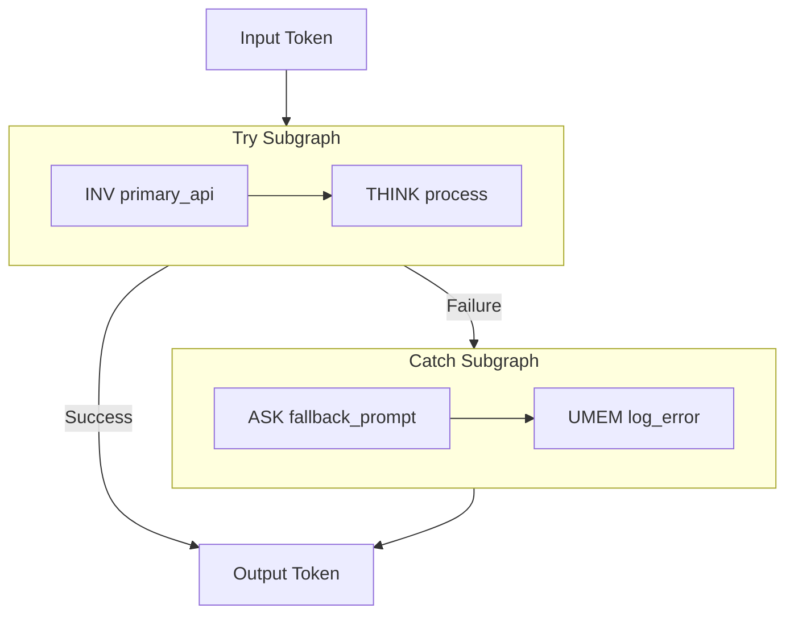
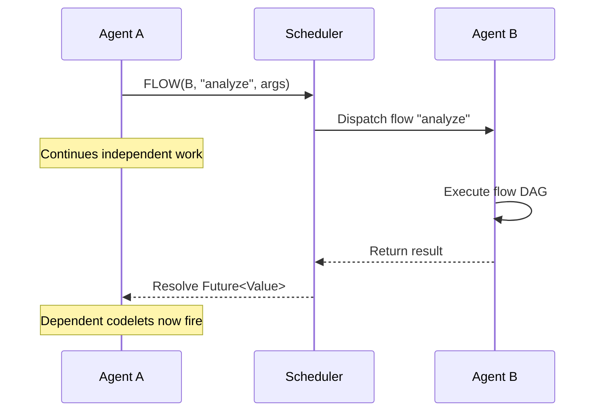
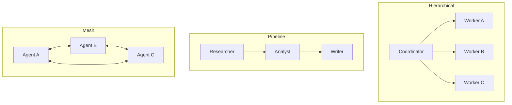

# Communication & Error Handling

These operations extend A-PXM beyond single-agent workflows into multi-agent systems and robust error recovery. TRY_CATCH provides structured exception handling within a dataflow graph; COMM and FLOW enable typed communication between agents.

## TRY_CATCH -- Exception Handling

Wraps a subgraph in an exception boundary. If any operation within the try subgraph fails, execution transfers to the catch subgraph for recovery.

**Signature:**
```
TRY_CATCH(trySubg: Subgraph, catchSubg: Subgraph) -> Value
```

| Operand | Type | Description |
|---------|------|-------------|
| `trySubg` | `Subgraph` | The primary execution subgraph |
| `catchSubg` | `Subgraph` | The recovery subgraph, executed on failure |

**Semantics:**

1. Execute `trySubg` normally under dataflow scheduling.
2. If all operations in `trySubg` complete successfully, emit the final token as the result.
3. If any operation in `trySubg` fails (tool error, LLM timeout, type mismatch), halt remaining operations in `trySubg`.
4. Pass the error token (containing failure metadata) to `catchSubg`.
5. Execute `catchSubg` and emit its result.



**Example:**
```mlir
%result = "ais.try_catch"() ({
  // Try: call the primary API and process results
  %data = "ais.inv"(%primary_api, %params) : (...) -> !ais.future<!ais.tool_result>
  %processed = "ais.think"(%process_prompt, %data) : (...) -> !ais.future<!ais.string>
  "ais.yield"(%processed) : (!ais.future<!ais.string>) -> ()
}, {
  ^catch(%error: !ais.error):
  // Catch: use a fallback strategy
  %fallback = "ais.ask"(%fallback_prompt, %error) : (...) -> !ais.future<!ais.string>
  "ais.yield"(%fallback) : (!ais.future<!ais.string>) -> ()
}) : () -> !ais.value
```

### Error Scoping

TRY_CATCH scopes are **lexical** within the DAG. An error in a nested TRY_CATCH is handled by the innermost enclosing catch subgraph. If the catch subgraph itself fails, the error propagates to the next outer TRY_CATCH.

### Recovery Patterns

| Pattern | Try Subgraph | Catch Subgraph |
|---------|-------------|----------------|
| **Fallback tool** | INV primary_api | INV backup_api |
| **Graceful degradation** | REASON deep_analysis | ASK simple_summary |
| **Human escalation** | INV automated_process | COMM human_agent |
| **Retry with backoff** | INV flaky_api | INV flaky_api (with delay) |

## COMM -- Communicate

Sends a typed message to another agent. COMM is the primitive for multi-agent coordination.

**Signature:**
```
COMM(rcpt: AgentID, msg: Message, prot: Protocol) -> Ack
```

| Operand | Type | Description |
|---------|------|-------------|
| `rcpt` | `AgentID` | The recipient agent's identifier |
| `msg` | `Message` | The typed message payload |
| `prot` | `Protocol` | Communication protocol (request-reply, fire-and-forget, broadcast) |

**Protocols:**

| Protocol | Semantics | Blocking? |
|----------|-----------|-----------|
| `REQUEST_REPLY` | Send message, wait for typed response | Yes -- blocks until reply |
| `FIRE_FORGET` | Send message, continue immediately | No -- returns Ack |
| `BROADCAST` | Send to all registered agents | No -- returns Ack |

**Example:**
```mlir
%ack = "ais.comm"(%research_agent, %findings_msg, %request_reply) : (
  !ais.agent_id, !ais.message, !ais.protocol
) -> !ais.ack
```

## FLOW -- Cross-Agent Flow Invocation

Invokes a named flow on a remote agent and returns a future handle to the result. FLOW is the cross-agent equivalent of a function call.

**Signature:**
```
FLOW(agent: AgentID, flow: FlowName, args: Args) -> Future<Value>
```

| Operand | Type | Description |
|---------|------|-------------|
| `agent` | `AgentID` | The target agent |
| `flow` | `FlowName` | The name of the flow to invoke |
| `args` | `Args` | Typed arguments matching the flow's input signature |

**Semantics:** FLOW dispatches work to another agent's dataflow scheduler and returns immediately with a `Future<Value>`. The calling agent can continue executing independent operations while the remote flow runs. When the future resolves, downstream codelets that depend on it become eligible to fire.



**Example:**
```mlir
%analysis = "ais.flow"(%analyst_agent, %analyze_flow, %report_data) : (
  !ais.agent_id, !ais.flow_name, !ais.args
) -> !ais.future<!ais.value>

// Independent work continues in parallel
%summary = "ais.ask"(%quick_summary_prompt, %ctx) : (...) -> !ais.future<!ais.string>

// Synchronize when both are needed
%combined = "ais.wait_all"(%analysis, %summary) : (...) -> !ais.tuple<...>
```

## Multi-Agent Topology

COMM and FLOW enable various multi-agent topologies:



All topologies use the same primitives (COMM, FLOW) with the dataflow scheduler automatically managing parallelism across agents. In evaluation, multi-agent workloads achieve up to **10.37x latency reduction** compared to sequential inter-agent communication.
