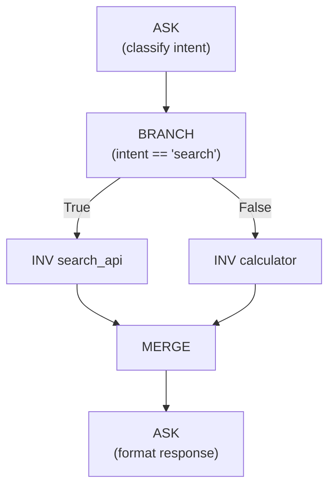
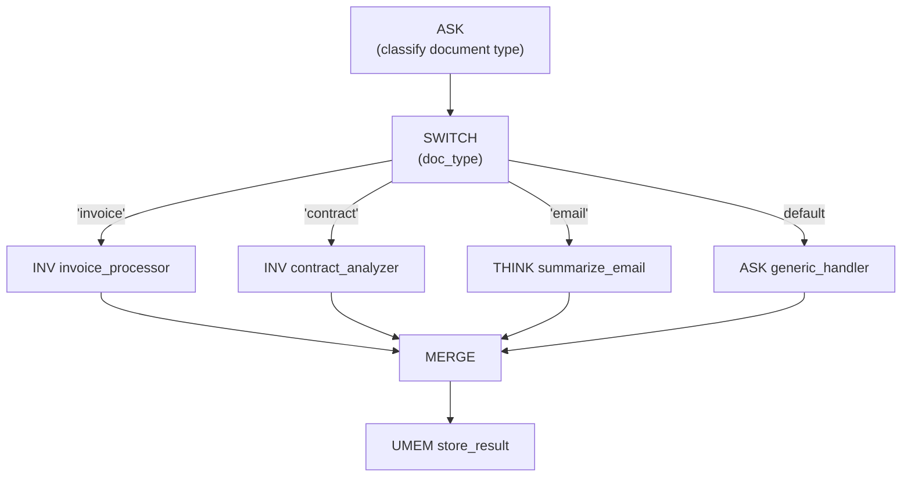

# Control Flow

Control flow operations route tokens through different subgraphs based on runtime values. Unlike traditional if/else statements that redirect a program counter, A-PXM's control flow operations route **data tokens** -- the downstream subgraph that receives the token is the one that executes.

## BRANCH -- BranchOnValue

Conditional branch that routes execution based on whether a token matches an expected value.

**Signature:**
```
BRANCH(tok: Token, val: Value, lblT: Label, lblF: Label) -> Void
```

| Operand | Type | Description |
|---------|------|-------------|
| `tok` | `Token` | The token to evaluate |
| `val` | `Value` | The value to compare against |
| `lblT` | `Label` | Target subgraph if `tok == val` |
| `lblF` | `Label` | Target subgraph if `tok != val` |

**Semantics:** BRANCH evaluates the comparison and emits the token to exactly one of two outgoing edges. The target subgraph receives the token and its codelets become eligible to fire; the other subgraph receives nothing and remains dormant.



**Example:**
```mlir
%intent = "ais.ask"(%classify_prompt, %ctx) : (...) -> !ais.future<!ais.string>

"ais.branch"(%intent, %search_val, @search_subgraph, @calc_subgraph) : (
  !ais.future<!ais.string>, !ais.string, !ais.label, !ais.label
) -> ()
```

### Conditional Latency Savings

In sequential execution, both branches would typically be evaluated (or the developer must manually implement conditional logic). With BRANCH, only the taken path executes. In evaluation workloads, this yields up to **5.18x latency reduction** through conditional routing -- the untaken branch contributes zero latency.

## SWITCH -- Multi-Way Branch

Routes tokens to one of N target subgraphs based on a discriminant value. SWITCH generalizes BRANCH for cases with more than two outcomes.

**Signature:**
```
SWITCH(disc: Value, cases: [(Value, Label)]) -> Void
```

| Operand | Type | Description |
|---------|------|-------------|
| `disc` | `Value` | The discriminant value to match |
| `cases` | `[(Value, Label)]` | Ordered list of (match value, target label) pairs |

**Semantics:** The discriminant is compared against each case value in order. The first matching case receives the token. If no case matches and a default label is provided, the token routes there; otherwise, it is an error (caught at compile time if the discriminant type is an enum with exhaustive cases).



**Example:**
```mlir
%doc_type = "ais.ask"(%classify_prompt, %doc_ctx) : (...) -> !ais.future<!ais.string>

"ais.switch"(%doc_type, [
  (%invoice_val, @invoice_subgraph),
  (%contract_val, @contract_subgraph),
  (%email_val, @email_subgraph)
]) { default = @generic_subgraph } : (
  !ais.future<!ais.string>, !ais.case_list
) -> ()
```

## Interaction with MERGE

Both BRANCH and SWITCH create divergent paths that typically reconverge at a MERGE or WAIT_ALL node. The MERGE operation accepts a token from **any one** of its input edges, producing a single output token. This allows the graph to continue uniformly regardless of which branch was taken.

## Compile-Time Verification

The compiler verifies control flow operations statically:

| Check | Description |
|-------|-------------|
| **Type compatibility** | Discriminant type must be comparable with case values |
| **Exhaustiveness** | For enum discriminants, all variants must be covered (or a default provided) |
| **Reachability** | Every branch target must be a valid subgraph label |
| **Reconvergence** | Divergent paths should reconverge at a MERGE (warning if they do not) |

These checks prevent an entire class of runtime errors -- routing to nonexistent subgraphs, comparing incompatible types, or leaving dead-end branches without synchronization.
