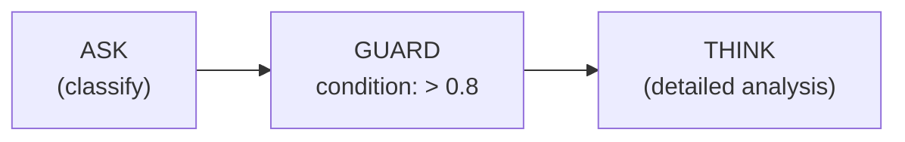
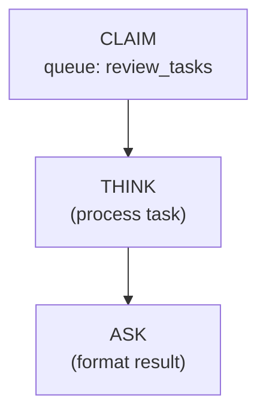
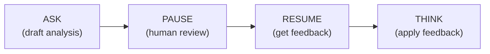

# Coordination Operations

Coordination operations extend the AIS with capabilities for multi-agent collaboration and human-in-the-loop workflows. These five operations (Phase 1 ISA Extensions) handle goal management, precondition enforcement, distributed task claiming, and execution suspension/resumption.

## UPDATE_GOAL -- Modify AAM Goals at Runtime

Dynamically modifies the agent's goal set during execution. Supports three actions: `set` (upsert a goal with priority), `remove` (delete a specific goal), and `clear` (remove all goals). Goal changes are visible to subsequent REASON and REFLECT nodes.

**Signature:**
```
UPDATE_GOAL(goal_id: String, action?: String, priority?: u32) -> Value
```

**Attributes:**

| Attribute | Required | Description |
|-----------|----------|-------------|
| `goal_id` | Yes | Goal identifier (used as description key for upsert/remove) |
| `action` | No | `set` (default), `remove`, or `clear` |
| `priority` | No | Goal priority (u32, default: 1) |

**Latency:** None (~10ms)

**Example:**
```json
{"id": 3, "op": "UPDATE_GOAL", "attributes": {"goal_id": "optimize_latency", "action": "set", "priority": 2}}
```

**Use Cases:**
- Adjust agent priorities based on intermediate results
- Clear completed goals after a sub-task finishes
- Shift focus from research to synthesis mid-workflow

---

## GUARD -- Enforce Preconditions

Evaluates a condition expression against the input token. If the condition fails, the guard either halts execution with an error or skips the downstream subgraph (configurable via `on_fail`). Use to enforce invariants like confidence thresholds, non-null checks, or content validation.

**Signature:**
```
GUARD(condition: String, error_message?: String, on_fail?: String) -> Value
```

**Attributes:**

| Attribute | Required | Description |
|-----------|----------|-------------|
| `condition` | Yes | Condition expression: `> 0.8`, `!= null`, `not_empty`, etc. |
| `error_message` | No | Message on failure |
| `on_fail` | No | Failure mode: `halt` (default) or `skip` |

**Latency:** None (~10ms)

**Min Inputs:** 1 (requires an input token to evaluate against)

**Example:**
```json
{"id": 3, "op": "GUARD", "attributes": {"condition": "> 0.8", "on_fail": "skip", "error_message": "Confidence too low"}}
```

**Pattern -- Quality Gate:**


If classification confidence is below 0.8, the GUARD skips the expensive THINK operation.

---

## CLAIM -- Atomic Task Claiming

Claims a task from a distributed work queue managed by the APXM server. The claim is atomic -- only one agent gets each task. The claimed task is leased for a configurable duration. If the agent doesn't complete within the lease, the task returns to the queue for other agents.

**Signature:**
```
CLAIM(queue: String, lease_ms?: u64, max_wait_ms?: u64, server_url?: String) -> ToolResult
```

**Attributes:**

| Attribute | Required | Description |
|-----------|----------|-------------|
| `queue` | Yes | Queue name to claim from |
| `lease_ms` | No | Lease duration in ms (default: 60000) |
| `max_wait_ms` | No | Max time to wait for a task (default: 5000) |
| `server_url` | No | Override `APXM_SERVER_URL` env var |

**Latency:** Low (~100ms)

**Example:**
```json
{"id": 2, "op": "CLAIM", "attributes": {"queue": "review_tasks", "lease_ms": 30000}}
```

**Pattern -- Worker Pool:**


Multiple agents can run this same graph concurrently. Each claims a different task from the shared queue.

---

## PAUSE -- Suspend for Human Review

Creates a checkpoint and suspends execution until a human resumes it via the APXM server API. The pause message is displayed to the human reviewer. Optionally sends a webhook notification. The human can provide input that becomes this node's output token when RESUME is called.

**Signature:**
```
PAUSE(message: String, checkpoint_id?: String, timeout_ms?: u64, poll_interval_ms?: u64, notification_url?: String, server_url?: String) -> Value
```

**Attributes:**

| Attribute | Required | Description |
|-----------|----------|-------------|
| `message` | Yes | Human-readable message explaining the pause |
| `checkpoint_id` | No | Stable checkpoint ID (auto-generated if omitted) |
| `timeout_ms` | No | Max wait in ms (0 = indefinite, default: 0) |
| `poll_interval_ms` | No | Polling interval in ms (default: 2000) |
| `notification_url` | No | Webhook URL to notify on pause creation |
| `server_url` | No | Override `APXM_SERVER_URL` env var |

**Latency:** High (~5000ms, human-dependent)

**Example:**
```json
{"id": 5, "op": "PAUSE", "attributes": {"message": "Please review the analysis before proceeding"}}
```

---

## RESUME -- Resume from Checkpoint

Polls the APXM server for a specific checkpoint until a human resumes it. When resumed, the human's input (if any) becomes this node's output token. Configurable polling interval and max attempts prevent indefinite blocking.

**Signature:**
```
RESUME(checkpoint: String, poll_max_attempts?: u64, poll_interval_ms?: u64, server_url?: String) -> Value
```

**Attributes:**

| Attribute | Required | Description |
|-----------|----------|-------------|
| `checkpoint` | Yes | Checkpoint ID to resume from |
| `poll_max_attempts` | No | Max polling attempts (default 60 x 5s = 5 min) |
| `poll_interval_ms` | No | Interval between polls in ms (default: 5000) |
| `server_url` | No | Override `APXM_SERVER_URL` env var |

**Latency:** High (~5000ms, human-dependent)

**Example:**
```json
{"id": 6, "op": "RESUME", "attributes": {"checkpoint": "review_checkpoint_1"}}
```

**Pattern -- Human-in-the-Loop Review:**


The PAUSE creates a checkpoint with the draft. A human reviews it, optionally provides feedback, and triggers RESUME. The feedback flows as the RESUME node's output token into the downstream THINK.

---

## References

1. A. S. Rao and M. P. Georgeff, "BDI Agents: From Theory to Practice," in *Proc. ICMAS '95*, pp. 312-319, AAAI Press, 1995.

2. G. R. Gao, R. Patel, and T. St. John, "The Codelet Program Execution Model," presented at *WiA, ISCA '13*, Tel-Aviv, Israel, 2013.
