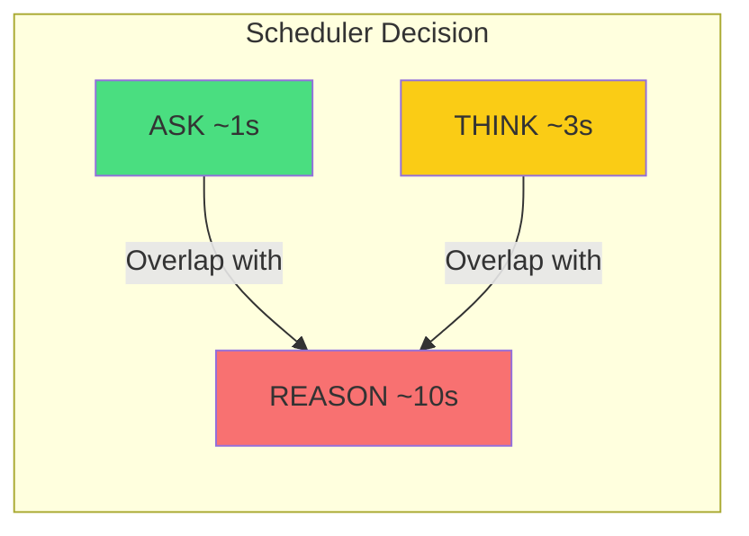

# LLM Operations

LLM operations are the core of agentic computation. A-PXM provides six distinct instructions, each targeting a different level of cognitive complexity and latency budget. This stratification enables the scheduler to make informed decisions about overlapping, prioritizing, and timing out LLM calls.

## ASK -- Fast Query

The lightest LLM operation, targeting ~1 second latency. Use ASK for classification, extraction, formatting, and simple question answering.

**Signature:**
```
ASK(prompt: String, ctx: Context) -> Future<String>
```

**Latency budget:** ~1s

**Use cases:**
- Intent classification ("Is this a search query or a calculation?")
- Entity extraction ("Extract the location from this sentence")
- Simple formatting ("Convert this JSON to a bullet list")

**Example:**
```mlir
%intent = "ais.ask"(%classify_prompt, %user_ctx) {
  latency_budget = 1000 : i64
} : (!ais.string, !ais.context) -> !ais.future<!ais.string>
```

## THINK -- Medium Reasoning

Moderate-complexity reasoning with a ~3 second latency budget. THINK handles tasks requiring multi-step logic, summarization, or synthesis of moderate context.

**Signature:**
```
THINK(prompt: String, ctx: Context) -> Future<String>
```

**Latency budget:** ~3s

**Use cases:**
- Document summarization
- Multi-step reasoning chains
- Comparison and contrast analysis
- Code review of individual functions

**Example:**
```mlir
%summary = "ais.think"(%summarize_prompt, %doc_ctx) {
  latency_budget = 3000 : i64
} : (!ais.string, !ais.context) -> !ais.future<!ais.string>
```

## REASON -- Deep Reasoning

The heaviest LLM operation, with a ~10 second latency budget. REASON is reserved for complex analysis requiring extensive chain-of-thought, planning over large contexts, or synthesis across multiple sources.

**Signature:**
```
REASON(prompt: String, ctx: Context) -> Future<String>
```

**Latency budget:** ~10s

**Use cases:**
- Cross-document contradiction detection
- Complex planning and strategy formulation
- Multi-source synthesis and analysis
- Architectural design decisions

**Example:**
```mlir
%analysis = "ais.reason"(%deep_prompt, %multi_doc_ctx) {
  latency_budget = 10000 : i64
} : (!ais.string, !ais.context) -> !ais.future<!ais.string>
```

## PLAN -- Goal Decomposition

Decomposes a high-level goal into a structured plan tree that downstream operations can consume. PLAN bridges the outer plan (developer's workflow) and inner plan (model's reasoning) by producing a typed, inspectable decomposition.

**Signature:**
```
PLAN(goal: Goal, ctx: Context) -> Future<PlanTree>
```

**Result type:** `PlanTree` -- a typed tree of sub-goals with dependencies, priorities, and estimated latencies.

**Example:**
```mlir
%plan = "ais.plan"(%research_goal, %domain_ctx) {
  max_depth = 3 : i64,
  max_branches = 5 : i64
} : (!ais.goal, !ais.context) -> !ais.future<!ais.plan_tree>
```

The `PlanTree` can be further compiled into a sub-DAG of codelets, enabling dynamic workflow expansion at runtime.

## REFL -- Reflect

Self-critique over the agent's episodic execution trace. REFL reads from episodic memory and produces a structured critique identifying errors, inefficiencies, and improvement opportunities.

**Signature:**
```
REFL(trace: EpisodicTrace, ctx: Context) -> Future<Critique>
```

**Result type:** `Critique` -- a typed structure containing identified issues, severity ratings, and suggested corrections.

**Example:**
```mlir
%critique = "ais.refl"(%recent_trace, %task_ctx) {
  focus = "accuracy",
  lookback_steps = 10 : i64
} : (!ais.episodic_trace, !ais.context) -> !ais.future<!ais.critique>
```

REFL enables **closed-loop self-improvement**: the agent reviews its own execution history and adjusts its strategy for subsequent operations.

## VERIFY -- Claim Validation

Validates a claim against provided evidence, producing a typed verdict. VERIFY is the type-safe alternative to asking an LLM "is this correct?" -- the result is a structured verdict, not a freeform string.

**Signature:**
```
VERIFY(claim: String, evidence: Value) -> Future<Verdict>
```

**Result type:** `Verdict` -- one of `CONFIRMED`, `REFUTED`, `INSUFFICIENT_EVIDENCE`, with confidence score and reasoning.

**Example:**
```mlir
%verdict = "ais.verify"(%claim, %supporting_docs) {
  confidence_threshold = 0.85
} : (!ais.string, !ais.value) -> !ais.future<!ais.verdict>
```

## Latency Strategy



The scheduler exploits latency stratification: when a REASON operation is in flight (~10s), independent ASK and THINK operations are dispatched concurrently. This transforms idle waiting time into productive computation.

## Comparison Table

| Operation | Budget | Output Type | Typical Use | Token Cost |
|-----------|--------|-------------|-------------|------------|
| ASK | ~1s | `String` | Classification, extraction | Low |
| THINK | ~3s | `String` | Summarization, reasoning | Medium |
| REASON | ~10s | `String` | Deep analysis, synthesis | High |
| PLAN | ~3-10s | `PlanTree` | Goal decomposition | Medium-High |
| REFL | ~3s | `Critique` | Self-critique, improvement | Medium |
| VERIFY | ~1-3s | `Verdict` | Fact-checking, validation | Low-Medium |
