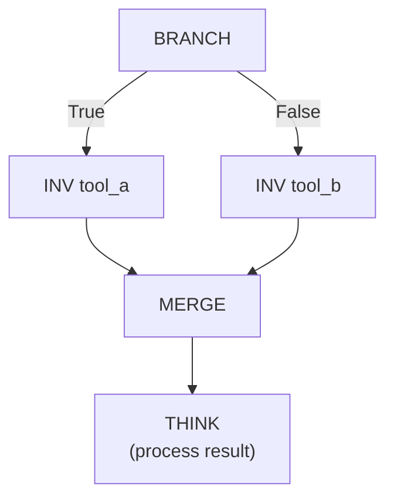
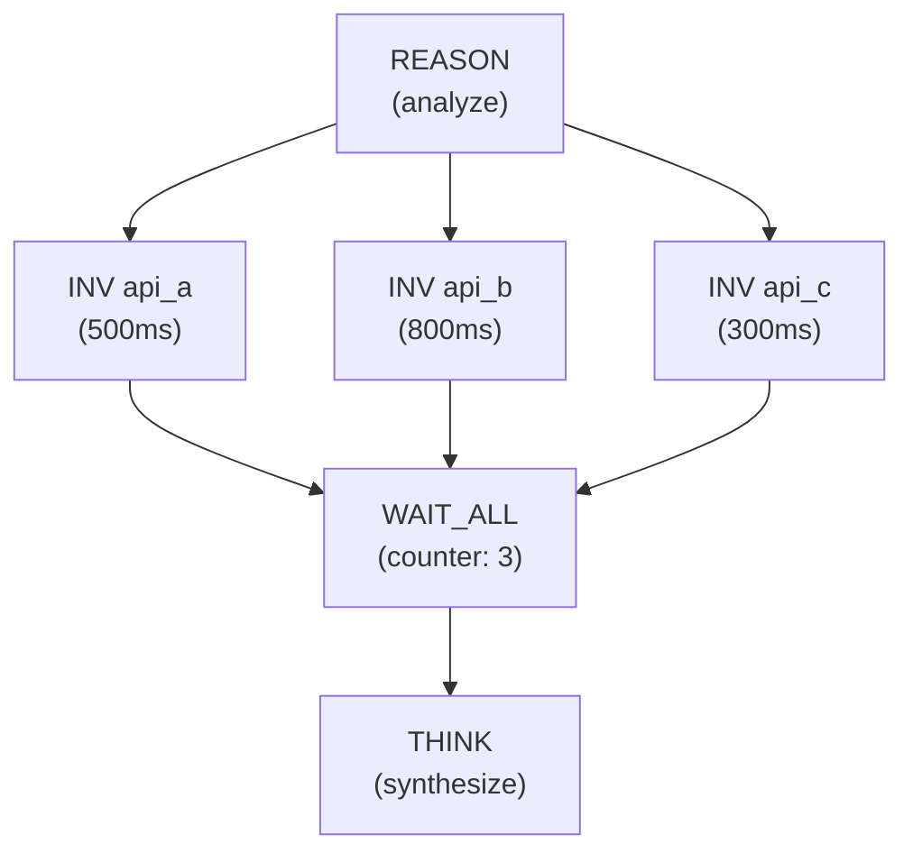
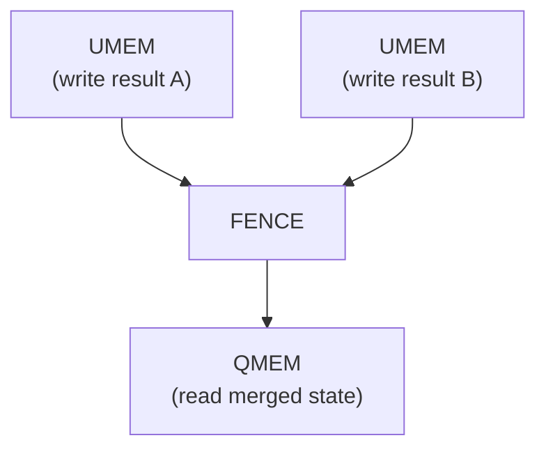

# Synchronization Operations

When the dataflow graph fans out into parallel paths, synchronization operations bring those paths back together. A-PXM provides three synchronization primitives, each with different semantics suited to different patterns.

## MERGE -- Synchronize Any Path

Accepts a token from **any one** of its input edges and produces a single output token. MERGE is used after BRANCH or SWITCH to reconverge divergent paths -- exactly one branch will have fired, and MERGE passes its result through.

**Signature:**
```
MERGE(tokens: List<Token>) -> Token
```

**Semantics:** MERGE waits for **exactly one** input token (since only one branch of a BRANCH/SWITCH fires). When that token arrives, MERGE emits it as its output.



**Key property:** MERGE does not wait for all inputs. It expects exactly one token because it sits after a conditional branch where only one path is taken. This distinguishes it from WAIT_ALL.

**Example:**
```mlir
%merged = "ais.merge"(%branch_a_result, %branch_b_result) : (
  !ais.token, !ais.token
) -> !ais.token
```

## WAIT_ALL -- Block Until All Tokens Available

Blocks until **all** input tokens are available, then produces a tuple of their resolved values. WAIT_ALL is the fan-in synchronization point for parallel execution paths.

**Signature:**
```
WAIT_ALL(tokens: List<Token>) -> List<Value>
```

**Semantics:** WAIT_ALL maintains a counter initialized to the number of input edges. Each arriving token decrements the counter. When the counter reaches zero, all values are collected and emitted as an ordered tuple.



In this example, WAIT_ALL's counter starts at 3. As each INV completes, the counter decrements. After 800ms (when the slowest call finishes), all three tokens are available and THINK can fire.

**Example:**
```mlir
%all_results = "ais.wait_all"(%search_result, %price_result, %review_result) : (
  !ais.future<!ais.tool_result>,
  !ais.future<!ais.tool_result>,
  !ais.future<!ais.tool_result>
) -> !ais.tuple<!ais.tool_result, !ais.tool_result, !ais.tool_result>
```

## FENCE -- Memory Barrier

Ensures all prior memory writes are visible before subsequent memory reads. FENCE creates an ordering constraint in the dataflow graph without carrying data.

**Signature:**
```
FENCE() -> Void
```

**Semantics:** FENCE acts as a barrier node in the DAG. All UMEM operations that precede FENCE (via data or control edges) must complete before any QMEM operations that follow FENCE can execute.



**When to use FENCE:**

| Scenario | FENCE needed? |
|----------|--------------|
| QMEM after UMEM with direct data edge | No -- the data edge already enforces ordering |
| QMEM after UMEM with no direct edge | **Yes** -- FENCE ensures the write is visible |
| Multiple UMEMs followed by a QMEM reading aggregate state | **Yes** -- FENCE ensures all writes complete |
| Cross-agent reads | No -- use COMM protocol instead |

## Comparison Table

| Operation | Waits for | Input count | Output | Use case |
|-----------|-----------|-------------|--------|----------|
| **MERGE** | Any one token | 1 of N | Single token | After BRANCH/SWITCH reconvergence |
| **WAIT_ALL** | All tokens | N of N | Tuple of values | Fan-in after parallel operations |
| **FENCE** | Prior writes | All preceding UMEMs | Ordering signal | Memory consistency |

## Patterns

### Diamond (Branch + Merge)
```
       BRANCH
      /      \
   path_A   path_B
      \      /
       MERGE
```
Exactly one path fires; MERGE passes its result.

### Fan-Out / Fan-In (Parallel + WaitAll)
```
       source
      /  |  \
   op_A op_B op_C
      \  |  /
      WAIT_ALL
```
All three ops fire in parallel; WAIT_ALL collects all results.

### Write Barrier (UMEM + FENCE + QMEM)
```
   UMEM_A   UMEM_B
      \      /
       FENCE
         |
       QMEM
```
Both writes commit before the read executes.
