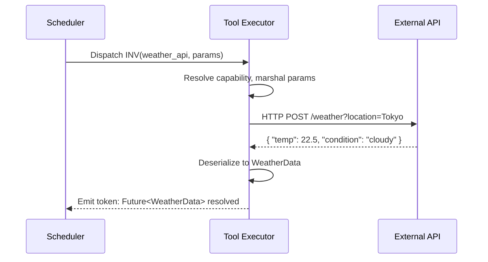
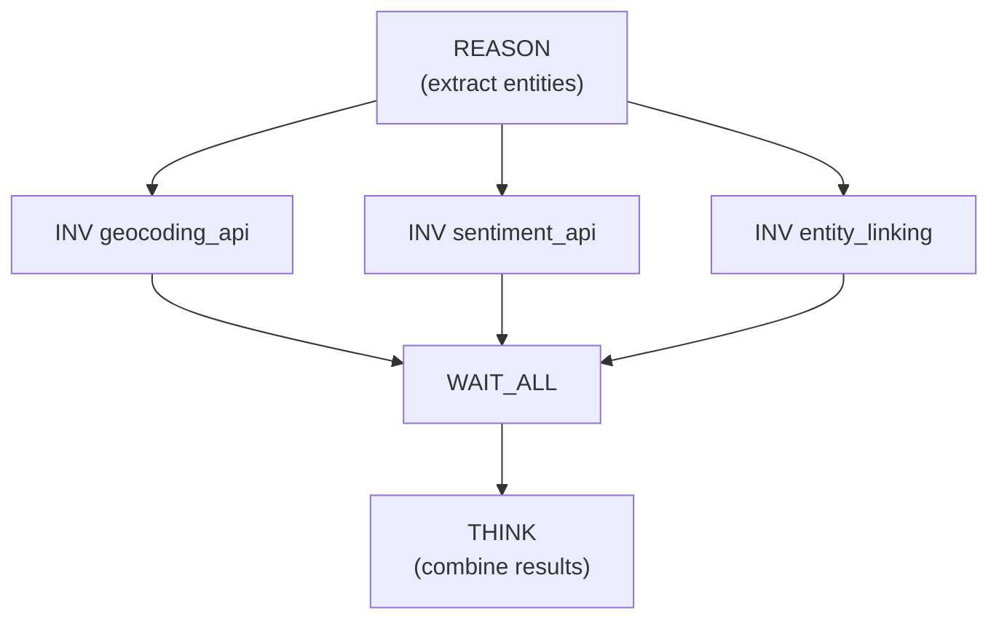

# Tool Operations

Tool operations bridge the agent's computational graph with the external world. A-PXM provides a single, unified instruction for all tool invocations, with type safety enforced at compile time.

## INV -- InvokeTool

Calls an external tool registered in the AAM's Capabilities map. Parameters are marshalled according to the tool's typed signature; results are typed tokens that flow into the dataflow graph.

**Signature:**
```
INV(tool: CapName, params: Params) -> Future<ToolResult>
```

| Operand | Type | Description |
|---------|------|-------------|
| `tool` | `CapName` | Name of the capability in the AAM's `C` map |
| `params` | `Params` | Typed parameter bundle matching the tool's input signature |

**Result:** `Future<ToolResult>` -- an async handle carrying the tool's typed output.

## Type Safety

At compile time, the compiler verifies that:

1. `tool` references an entry in the AAM's Capabilities map
2. `params` matches the tool's declared input signature
3. Downstream operations expecting `ToolResult` are compatible with the tool's output type

This catches errors like passing a `String` where a tool expects `Int`, or invoking a tool that does not exist -- at compile time, before any LLM call or API request is made.

```mlir
// AAM Capabilities declaration
// "weather_api": (location: String, units: String) -> WeatherData

// Correct invocation -- types match
%weather = "ais.inv"(%weather_api, %params) : (
  !ais.cap_name, !ais.params<location: !ais.string, units: !ais.string>
) -> !ais.future<!ais.tool_result<!ais.weather_data>>

// Compile error: missing required parameter 'units'
// %bad = "ais.inv"(%weather_api, %incomplete_params) : (...)
```

## Execution Semantics

1. The scheduler dispatches INV when all input tokens are available.
2. The tool executor resolves the capability name to a concrete endpoint.
3. Parameters are serialized according to the tool's schema.
4. The external call is made (HTTP, gRPC, local function, etc.).
5. The response is deserialized into the declared result type.
6. A typed token is emitted to all downstream edges.



## Error Handling

Tool invocations are inherently fallible -- APIs return errors, timeouts occur, schemas change. INV integrates with TRY_CATCH for structured error recovery:

```mlir
%result = "ais.try_catch"() ({
  // Try: invoke the primary tool
  %primary = "ais.inv"(%search_api, %params) : (...) -> !ais.future<!ais.tool_result>
  "ais.yield"(%primary) : (...) -> ()
}, {
  // Catch: fall back to a secondary tool
  %fallback = "ais.inv"(%backup_api, %params) : (...) -> !ais.future<!ais.tool_result>
  "ais.yield"(%fallback) : (...) -> ()
}) : () -> !ais.value
```

## Parallel Tool Invocation

When multiple INV operations depend on the same upstream token but not on each other, the dataflow scheduler dispatches them in parallel automatically:



Three independent API calls execute concurrently. Wall time is `max(geocoding, sentiment, entity_linking)` rather than their sum.

## Capability Registration

Tools are declared in the AAM's Capabilities map with typed signatures:

```
C = {
  "search_api":    (query: String, limit: Int) -> SearchResults,
  "calculator":    (expression: String) -> Float,
  "send_email":    (to: String, subject: String, body: String) -> SendStatus,
  "image_gen":     (prompt: String, size: ImageSize) -> ImageURL
}
```

The compiler uses these declarations to verify every INV instruction statically. Adding a new tool requires only updating the Capabilities map -- no changes to the workflow graph.
