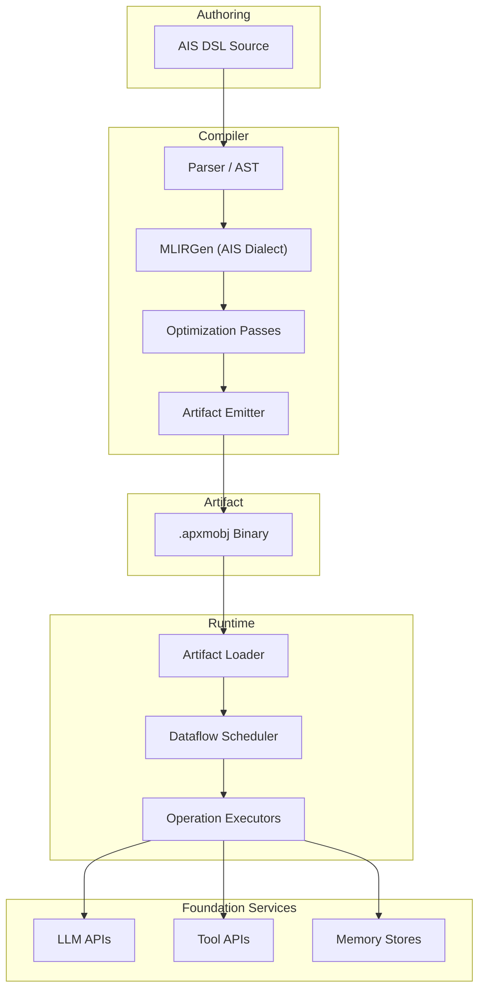
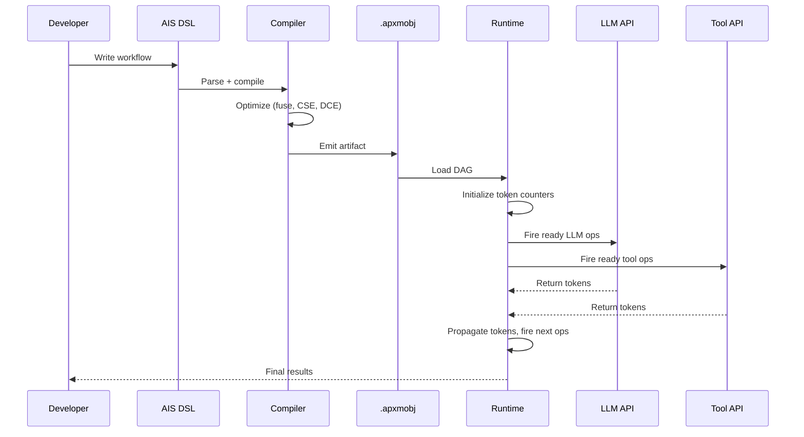

# Architecture

A-PXM is a vertically integrated system. Agent workflows are authored in a typed DSL, compiled through an MLIR-based pipeline, and executed on a dataflow scheduler that automatically extracts parallelism from the dependency graph.

## Full Stack

## Component Overview

### AIS DSL

The source language for A-PXM workflows. Each program declares an agent's Beliefs, Goals, and Capabilities (the AAM state), then defines a workflow as a sequence of typed AIS instructions. The DSL enforces type safety at authoring time -- malformed data flows are syntactic errors.

### Compiler Pipeline

The compiler transforms AIS source into an optimized execution artifact in four stages:

| Stage | Input | Output | Key Operations |
|-------|-------|--------|----------------|
| **Parse** | AIS DSL source | Abstract Syntax Tree | Lexing, parsing, semantic validation |
| **MLIRGen** | AST | AIS MLIR dialect | Type inference, custom op construction, verifier attachment |
| **Optimize** | Unoptimized MLIR | Optimized MLIR | FuseAskOps, CSE, dead-code elimination, canonicalization |
| **Emit** | Optimized MLIR | `.apxmobj` binary | DAG serialization, metadata embedding, schema packing |

### Artifact

The `.apxmobj` file is a portable, versioned binary containing the serialized dataflow graph, operation metadata, entry points, and parameter schemas. It can be loaded by any conforming A-PXM runtime.

### Dataflow Scheduler

The runtime's core: a token-based scheduler that tracks pending input counts for each operation. When a token arrives at an operation, its counter is decremented; when the counter reaches zero, the operation is enqueued for execution. This provides O(1) readiness detection without graph traversal.

### Operation Executors

Typed executors for each AIS instruction category:

- **Memory executor**: handles QMEM, UMEM, FENCE against the three-tier memory hierarchy
- **LLM executor**: dispatches ASK, THINK, REASON, PLAN, REFL, VERIFY to model APIs with latency budgets
- **Tool executor**: invokes external tools via INV with typed parameter marshalling
- **Control executor**: evaluates BRANCH, SWITCH for conditional routing
- **Sync executor**: manages MERGE, WAIT_ALL for parallel path synchronization
- **Communication executor**: handles COMM, FLOW for multi-agent messaging

## Data Flow Through the Stack

## Design Principles

1. **Separation of concerns**: the DSL describes intent; the compiler decides strategy; the runtime handles tactics.
2. **Type safety end-to-end**: from DSL authoring through MLIR verification to runtime token passing, every value is typed.
3. **Automatic parallelism**: developers never write `async`/`await`. The DAG structure makes independence explicit; the scheduler exploits it.
4. **Portability**: the `.apxmobj` artifact is runtime-agnostic. Different schedulers (single-machine, distributed, GPU-offloaded) can execute the same artifact.
5. **Observability**: every operation produces typed tokens that flow through the DAG, creating a complete, structured execution trace for debugging and reflection.
