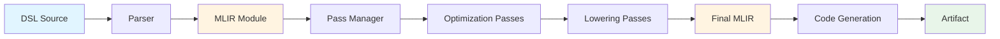
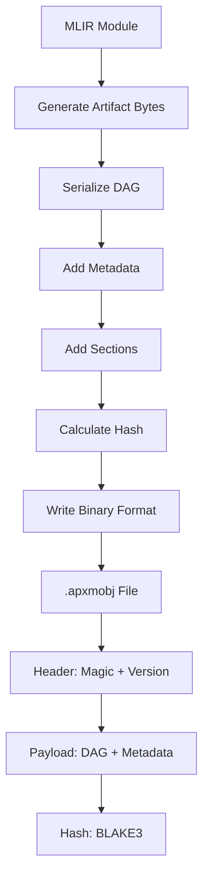
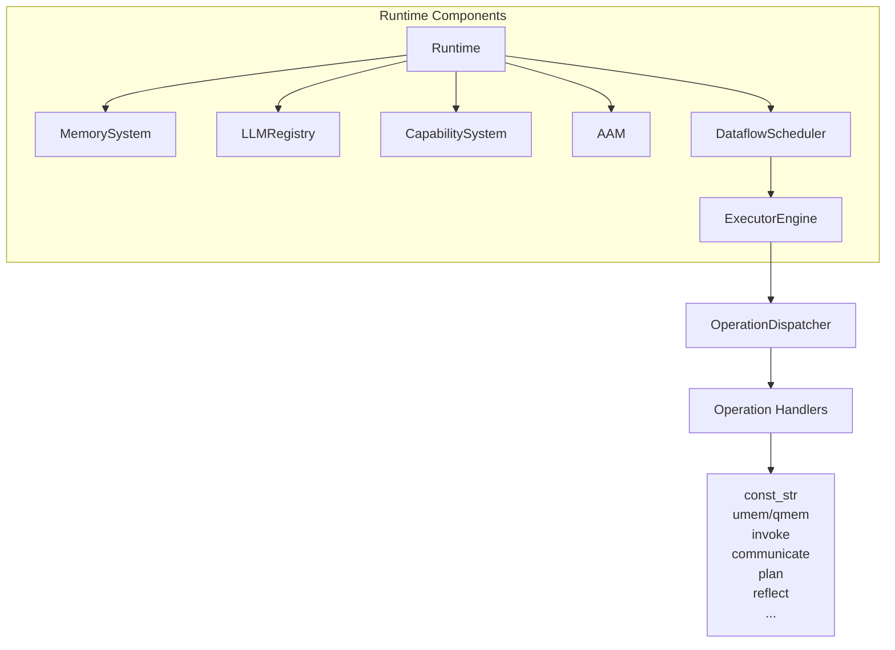
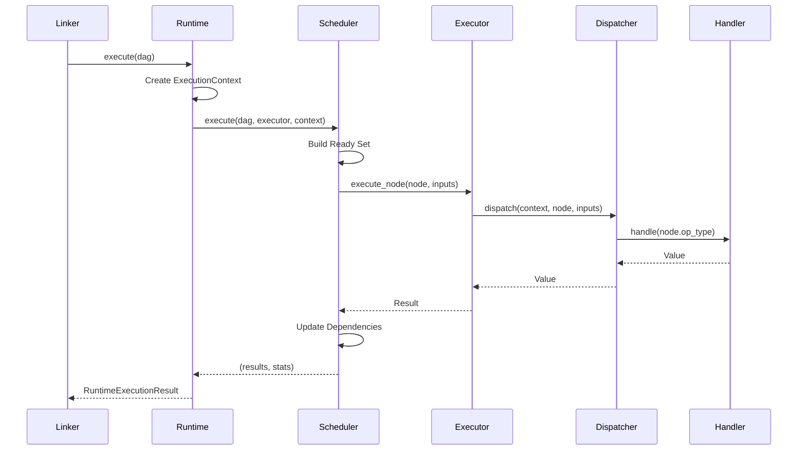
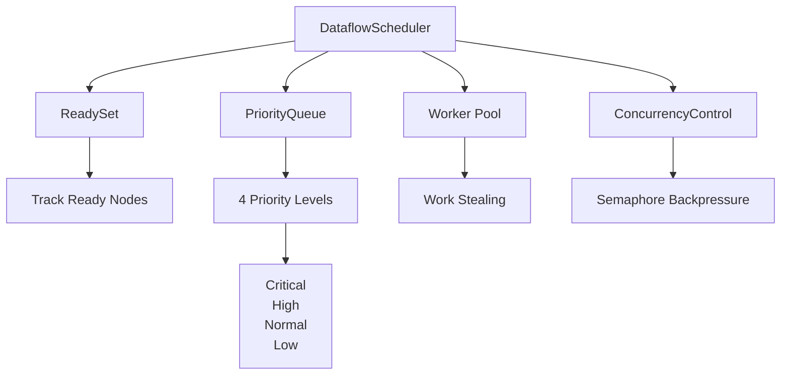
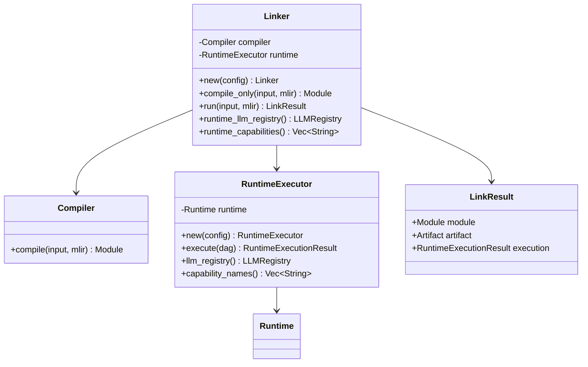
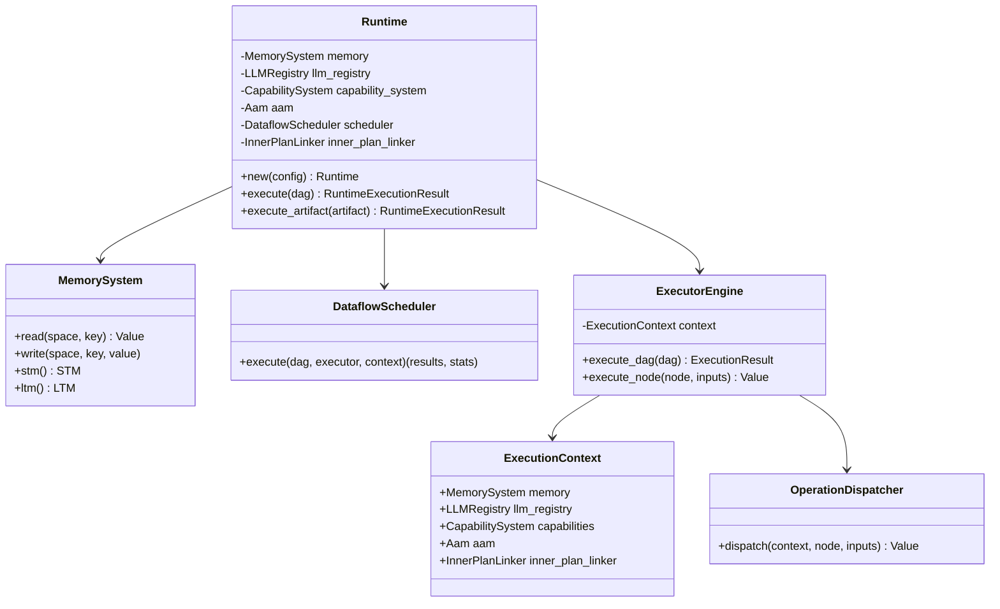
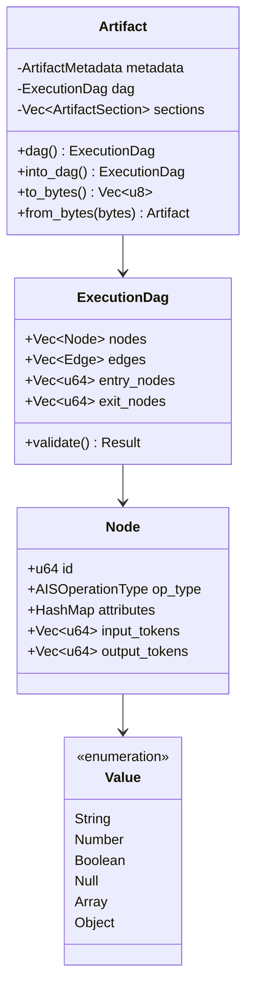

# APXM Architecture Documentation

This document provides a comprehensive overview of how the different packages in APXM interact with each other, including flowcharts, diagrams, and class relationships.

## Table of Contents

1. [System Overview](#system-overview)
2. [Package Structure](#package-structure)
3. [Driver Flows](#driver-flows)
4. [Compilation Pipeline](#compilation-pipeline)
5. [Runtime Execution](#runtime-execution)
7. [Class Relationships](#class-relationships)

---

## System Overview

APXM (Agent Programming eXecution Model) is a full toolchain for building autonomous agents that combines:
- A high-level DSL (AIS) for declaring memory, flows, handlers, and tool invocations
- A compiler that lowers AIS → MLIR → executable artifacts
- A runtime/linker that wires artifacts to capabilities, an LLM registry, and execution memory
- A driver crate that wires compiler + runtime
- A minimal CLI for compile/run workflows

### High-Level Architecture

```
┌─────────────────────────────────────────────────────────────────┐
│                          Driver                                 │
│  ┌──────────┐  ┌──────────┐  ┌──────────┐                     │
│  │ compile  │  │   run    │  │   link   │                     │
│  └────┬─────┘  └────┬─────┘  └────┬─────┘                     │
└───────┼─────────────┼─────────────┼──────────────────────────────┘
        │             │             │
        ▼             ▼             ▼
┌─────────────────────────────────────────────────────────────────┐
│                      Linker Layer                               │
│  ┌──────────────┐         ┌──────────────┐                    │
│  │   Compiler   │────────▶│   Runtime    │                    │
│  │  (MLIR/C++)  │         │  Executor    │                    │
│  └──────────────┘         └──────────────┘                    │
└─────────────────────────────────────────────────────────────────┘
        │                                     │
        ▼                                     ▼
┌──────────────────┐              ┌──────────────────────────────┐
│  Artifact        │              │  Runtime Components         │
│  (Binary Format) │              │  - Memory System            │
│                  │              │  - Scheduler                │
│  - DAG           │              │  - Executor Engine          │
│  - Metadata      │              │  - Capability System        │
│  - Sections      │              │  - LLM Registry             │
└──────────────────┘              └──────────────────────────────┘
```

---

## Package Structure

### Core Packages

- **`apxm-ais`**: AIS operation definitions and validation
- **`apxm-compiler`**: MLIR-based compiler (C++/Rust FFI)
- **`apxm-runtime`**: Execution engine with scheduler, memory, capabilities
- **`apxm-driver`**: Orchestrates compiler + runtime and config
- **`apxm-backends`**: LLM and storage backends
- **`apxm-core`**: Shared types, errors, and utilities
- **`apxm-artifact`**: Binary artifact format (serialized DAGs)
- **`apxm-ais`**: AIS metadata and TableGen source

### Package Dependencies

```
apxm-driver
├── apxm-compiler
├── runtime
│   ├── apxm-runtime
│   ├── apxm-core
│   ├── apxm-backends
│   └── apxm-artifact
└── apxm-ais
```

---

## Driver Flows

### 1. Compile Command Flow

```mermaid
graph TD
    A[apxm-driver compile()] --> B[Create Compiler Context]
    B --> C{Input Type?}
    C -->|.ais| D[Parse DSL]
    C -->|.mlir| E[Parse MLIR]
    D --> F[Module Object]
    E --> F
    F --> G[Build Pass Manager]
    G --> H[Run Optimization Passes]
    H --> I{Output Format?}
    I -->|Artifact| J[Generate Artifact]
    I -->|Rust| K[Generate Rust Code]
    I -->|MLIR| L[Dump MLIR Text]
    J --> M[Return Bytes]
    K --> M
    L --> M
```

**Key Components:**
- **`Context`**: MLIR compiler context (C++ FFI)
- **`Module`**: MLIR module representation
- **`PassManager`**: Orchestrates optimization passes
- **`Codegen`**: Emits artifact or Rust source

### 2. Run Command Flow

```mermaid
graph TD
    A[apxm-driver execute()] --> B[Load Config]
    B --> C[Create RuntimeExecutor]
    C --> D[Compiler.compile]
    D --> E[Module.generate_artifact_bytes]
    E --> F[Artifact.from_bytes]
    F --> G[Validate DAG]
    G --> H[RuntimeExecutor.execute]
    H --> I[Runtime.execute]
    I --> J[DataflowScheduler.execute]
    J --> K[ExecutorEngine.execute_dag]
    K --> L[OperationDispatcher.dispatch]
    L --> M[Return Results]
```

**Key Components:**
- **`Compiler`**: Wraps MLIR compiler
- **`RuntimeExecutor`**: Wraps runtime with LLM/capability setup
- **`Runtime`**: Main runtime orchestrator
- **`DataflowScheduler`**: Parallel execution scheduler
- **`ExecutorEngine`**: Operation execution engine

---

## Compilation Pipeline

### Compilation Stages



### Optimization Pipeline (by -O level)

**O0 (No optimization):**
- `canonicalizer` → `cse`

**O1 (Basic):**
- `normalize` → `scheduling` → `fuse-reasoning` → `canonicalizer` → `cse` → `symbol-dce`

**O2 (Standard):**
- O1 pipeline + second `fuse-reasoning` pass + `canonicalizer`

**O3 (Aggressive):**
- Multiple rounds of fusion, scheduling, and cleanup passes

### Artifact Generation



**Artifact Structure:**
- **Header**: Magic bytes (`APXM`), version, timestamp, hash, payload size
- **Payload**: Serialized DAG (nodes, edges, metadata)
- **Sections**: Optional additional data sections

---

## Runtime Execution

### Runtime Architecture



### Execution Flow



### Memory System

```
┌─────────────────────────────────────────┐
│         MemorySystem                    │
├─────────────────────────────────────────┤
│  ┌──────────┐  ┌──────────┐  ┌────────┐│
│  │   STM    │  │   LTM    │  │Episodic││
│  │(Working) │  │(Persist) │  │(Events)││
│  └──────────┘  └──────────┘  └────────┘│
└─────────────────────────────────────────┘
```

- **STM (Short-Term Memory)**: Working memory for current execution
- **LTM (Long-Term Memory)**: Persistent storage (SQLite or in-memory)
- **Episodic**: Event/experience storage

### Scheduler Architecture



**Features:**
- Token-based automatic parallelism
- O(1) readiness tracking
- Exponential backoff retry
- Deadlock detection
- Semaphore-based backpressure

---

## Class Relationships

### Linker Package



### Runtime Package



### Core Types



---

## Data Flow Summary

### Complete Execution Flow (Run Command)

```
User Input (DSL/MLIR)
    ↓
Linker.run()
    ↓
Compiler.compile() → Module
    ↓
Module.generate_artifact_bytes() → Vec<u8>
    ↓
Artifact.from_bytes() → Artifact
    ↓
Artifact.dag() → ExecutionDag
    ↓
Runtime.execute(dag)
    ↓
DataflowScheduler.execute(dag, executor, context)
    ↓
ExecutorEngine.execute_node() (for each ready node)
    ↓
OperationDispatcher.dispatch()
    ↓
Operation Handler (const_str, invoke, communicate, etc.)
    ↓
Value (result)
    ↓
RuntimeExecutionResult { results, stats }
```

## Key Design Patterns

1. **Orchestration Pattern**: `Linker` orchestrates `Compiler` and `Runtime`
2. **Strategy Pattern**: Different operation handlers via `OperationDispatcher`
3. **Factory Pattern**: `LLMRegistry` creates backend instances
4. **Builder Pattern**: Configuration builders for `RuntimeConfig`, `LinkerConfig`

---

## Error Handling

Errors flow through the system with proper error types:

```
DriverError
├── Compiler(CompilerError)
├── Runtime(RuntimeError)
├── Config { message }
└── Io(io::Error)

RuntimeError
├── State(String)
├── Execution(String)
└── Memory(String)
```

---

## Configuration Flow

```
Project .apxm/config.toml (walking up directories)
    ↓
Global ~/.apxm/config.toml
    ↓
ApXmConfig (TOML deserialization)
    ↓
RuntimeConfig
    ↓
Component initialization
```

---

This architecture enables:
- **Separation of Concerns**: Each package has a clear responsibility
- **Composability**: Components can be used independently
- **Extensibility**: New operation types, LLM backends, and capabilities can be added
- **Testability**: Each layer can be tested in isolation
- **Performance**: Parallel execution via dataflow scheduler
- **Reliability**: Comprehensive error handling and validation
