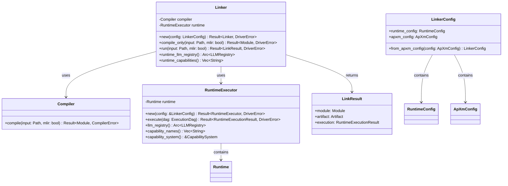
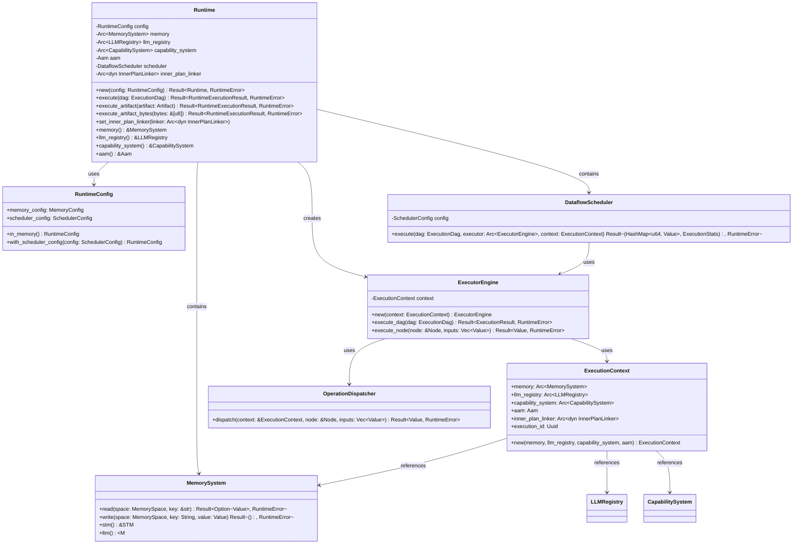
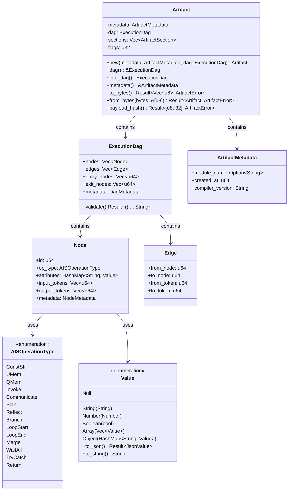
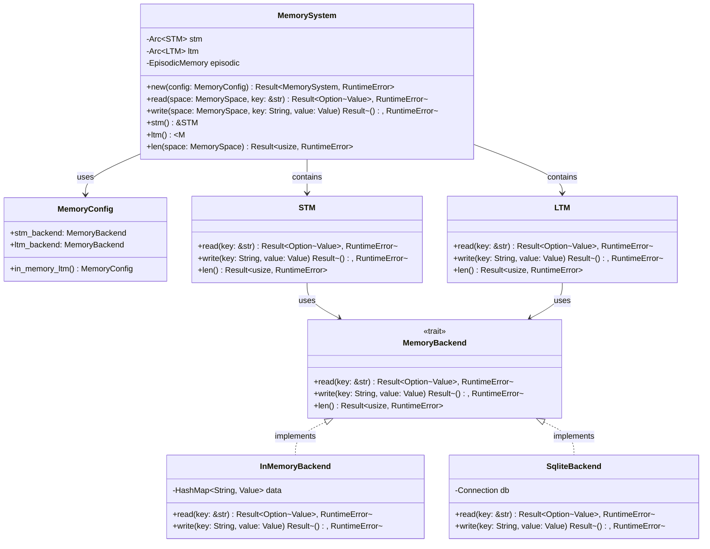
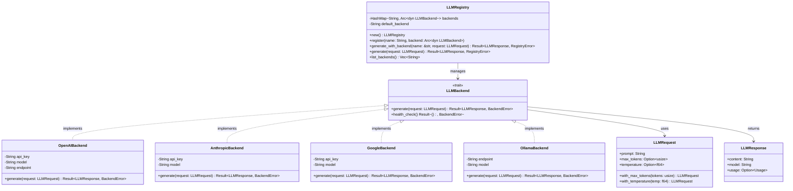
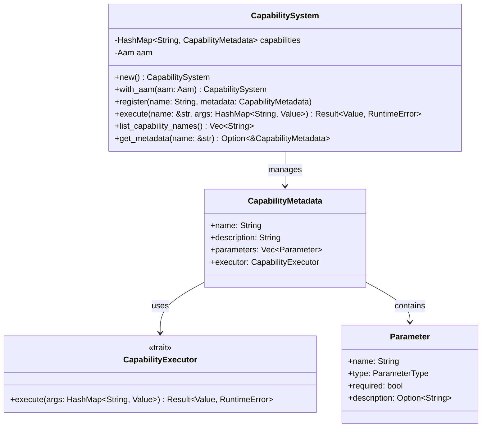
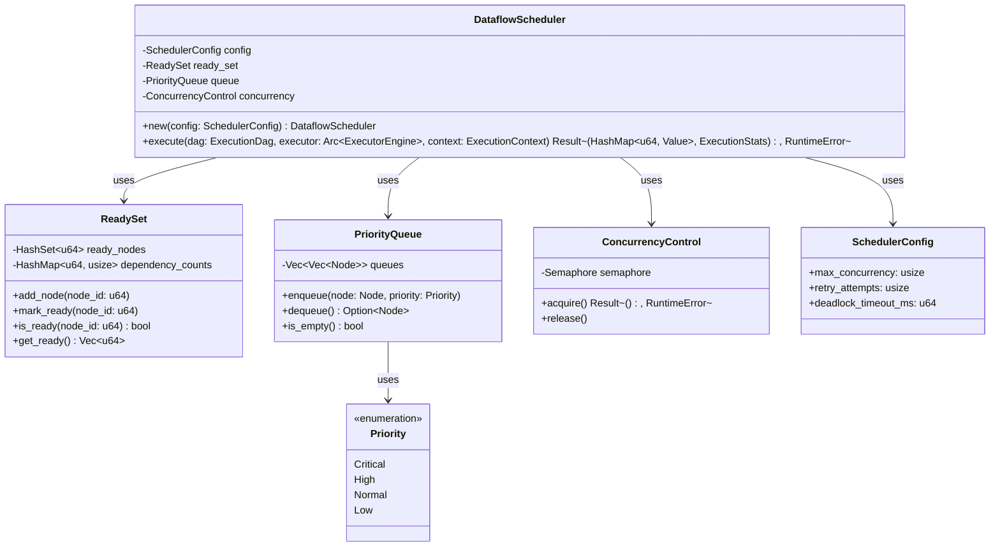

# APXM Class Relationships

This document provides detailed class relationship diagrams for understanding the object-oriented structure of APXM.

## 1. Linker Package Classes



## 2. Runtime Package Classes



## 3. Core Types Classes



## 4. Memory System Classes



## 5. LLM Registry Classes



## 6. Capability System Classes



## 7. Scheduler Classes



## 8. Operation Handler Classes

```mermaid
classDiagram
    class OperationDispatcher {
        +dispatch(context: &ExecutionContext, node: &Node, inputs: Vec~Value~) Result~Value, RuntimeError~
    }
    
    class OperationHandler {
        <<trait>>
        +handle(context: &ExecutionContext, node: &Node, inputs: Vec~Value~) Result~Value, RuntimeError~
    }
    
    class ConstStrHandler {
        +handle(context, node, inputs) Result~Value, RuntimeError~
    }
    
    class UMemHandler {
        +handle(context, node, inputs) Result~Value, RuntimeError~
    }
    
    class QMemHandler {
        +handle(context, node, inputs) Result~Value, RuntimeError~
    }
    
    class InvokeHandler {
        +handle(context, node, inputs) Result~Value, RuntimeError~
    }
    
    class CommunicateHandler {
        +handle(context, node, inputs) Result~Value, RuntimeError~
    }
    
    class PlanHandler {
        +handle(context, node, inputs) Result~Value, RuntimeError~
    }
    
    class ReflectHandler {
        +handle(context, node, inputs) Result~Value, RuntimeError~
    }
    
    class BranchHandler {
        +handle(context, node, inputs) Result~Value, RuntimeError~
    }
    
    OperationDispatcher --> OperationHandler : uses
    OperationHandler <|.. ConstStrHandler : implements
    OperationHandler <|.. UMemHandler : implements
    OperationHandler <|.. QMemHandler : implements
    OperationHandler <|.. InvokeHandler : implements
    OperationHandler <|.. CommunicateHandler : implements
    OperationHandler <|.. PlanHandler : implements
    OperationHandler <|.. ReflectHandler : implements
    OperationHandler <|.. BranchHandler : implements
```



## 9. Error Hierarchy

```mermaid
classDiagram
    class Error {
        <<trait>>
        +source() Option~&dyn Error~
        +description() String
    }
    
    class DriverError {
        <<enumeration>>
        Compiler(CompilerError)
        Runtime(RuntimeError)
        Config { message: String }
        Io(io::Error)
    }
    
    class RuntimeError {
        <<enumeration>>
        State(String)
        Execution(String)
        Memory(String)
        Capability(String)
    }
    
    class CompilerError {
        +message: String
        +span: Option~Span~
        +suggestion: Option~Suggestion~
    }
    
    Error <|.. DriverError
    Error <|.. RuntimeError
    Error <|.. CompilerError
    DriverError --> CompilerError : contains
    DriverError --> RuntimeError : contains
```

---

## Key Relationships Summary

1. **Composition**: `Runtime` contains `MemorySystem`, `LLMRegistry`, `CapabilitySystem`, `DataflowScheduler`
2. **Aggregation**: `Linker` uses `Compiler` and `RuntimeExecutor` but doesn't own them
3. **Dependency**: `ExecutorEngine` depends on `ExecutionContext` and `OperationDispatcher`
4. **Trait Implementation**: Multiple backends implement `LLMBackend` trait
5. **Strategy Pattern**: Different operation handlers implement `OperationHandler` trait
6. **Factory Pattern**: `LLMRegistry` creates and manages backend instances
7. **Observer Pattern**: Runtime emits tracing/metrics events

These relationships enable:
- **Modularity**: Components can be swapped or extended independently
- **Testability**: Dependencies can be mocked or stubbed
- **Flexibility**: New operation types, backends, and capabilities can be added
- **Maintainability**: Clear separation of concerns
