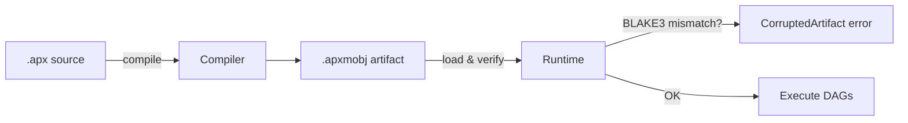

# Artifact Format

A-PXM compiles flows into `.apxmobj` binary artifacts. This format is designed for
fast loading, integrity verification, and deterministic reproducibility.

## Binary Layout

```
 Offset  Size   Field
 ──────  ────   ─────────────────
 0       4      MAGIC ("APXM")
 4       4      VERSION (u32, little-endian)
 8       8      PAYLOAD_LEN (u64, little-endian)
 16      32     BLAKE3_HASH (256-bit digest of PAYLOAD)
 48      4      FLAGS (u32, bitfield)
 52      var    PAYLOAD (bincode-serialized ArtifactPayload)
```

The fixed 52-byte header allows tools to inspect version and integrity without
deserializing the full payload.

## Flags Bitfield

| Bit | Meaning                        |
|-----|--------------------------------|
| 0   | Contains sub-flows             |
| 1   | Uses multi-agent instructions  |
| 2   | Requires LTM persistence       |
| 3-31| Reserved (must be zero)        |

## ArtifactPayload

The payload is [bincode](https://github.com/bincode-org/bincode)-serialized and
contains three top-level fields:

```rust
struct ArtifactPayload {
    metadata: ArtifactMetadata,   // name, version, compile timestamp
    dags: Vec<WireDag>,           // entry flows + sub-flows
    sections: Vec<ArtifactSection>, // auxiliary data (prompts, schemas)
}
```

### WireDag

Each `WireDag` encodes a single dataflow graph. Attributes on nodes and edges
are stored in **sorted order** (by key) to guarantee deterministic serialization.
Two compilations of the same source always produce byte-identical payloads.

### Multiple DAGs

A single artifact may bundle several DAGs:

- **Entry flow** -- the top-level graph executed on invocation.
- **Sub-flows** -- graphs referenced by `FLOW` instructions, inlined at compile
  time for zero-cost dispatch.

## Integrity Verification

On load the runtime:

1. Reads the 52-byte header.
2. Reads `PAYLOAD_LEN` bytes of payload.
3. Computes BLAKE3 over the payload bytes.
4. Compares against `BLAKE3_HASH`; aborts with `CorruptedArtifact` on mismatch.

This prevents silent corruption from disk errors or incomplete writes.



## Versioning

The `VERSION` field allows the runtime to reject artifacts compiled by a newer
compiler. The current version is **1**. Future versions will maintain backwards
compatibility or provide explicit migration tooling.

## Design Rationale

- **bincode** was chosen over protobuf/msgpack for zero-copy deserialization
  speed and tight Rust integration.
- **BLAKE3** provides 256-bit security with throughput exceeding 1 GB/s on
  modern hardware, adding negligible overhead to artifact loading.
- **Sorted attributes** trade a small compile-time cost for reproducible builds,
  enabling content-addressable caching of artifacts.
