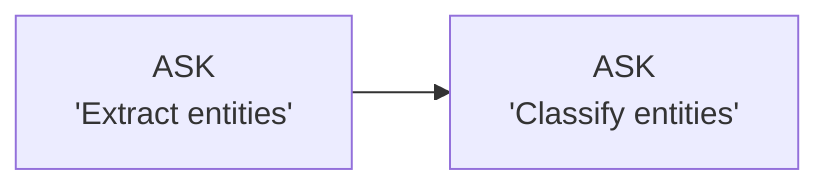
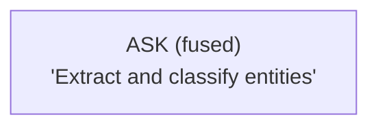
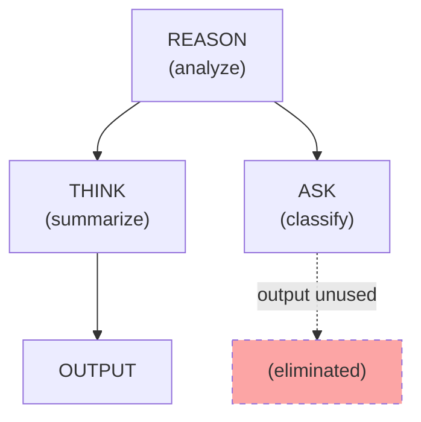
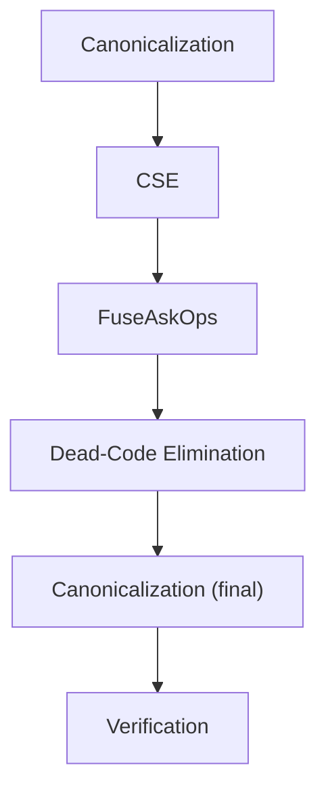

# Optimization Passes

The A-PXM compiler runs a sequence of optimization passes over the AIS MLIR representation. Each pass transforms the dataflow graph to reduce latency, eliminate redundant operations, or normalize patterns for more efficient execution.

## FuseAskOps

**Category:** Domain-specific
**Improvement:** 1.29x fewer API round-trips

FuseAskOps identifies producer-consumer chains of ASK operations where the output of one ASK feeds directly into the prompt of the next. Rather than making two sequential API calls, the pass fuses them into a single call with a combined prompt.

### Before Fusion



Two API calls, sequential. Total latency: ~2s.

### After Fusion



One API call. Total latency: ~1s. The fused prompt instructs the model to perform both tasks in a single inference pass.

### Applicability Conditions

FuseAskOps fires when:

1. Operation A produces a `String` output consumed only by operation B
2. Both A and B are ASK operations (same latency tier)
3. B's prompt is a template that interpolates A's output
4. No side effects between A and B (no UMEM, INV, or COMM)

The pass is conservative: it will not fuse operations across TRY_CATCH boundaries, across FENCE barriers, or when the intermediate result is consumed by multiple downstream operations.

## CSE -- Common Subexpression Elimination

**Category:** Classical
**Improvement:** Variable (depends on workflow redundancy)

CSE identifies operations with identical opcodes and identical input tokens, replacing duplicates with a single operation whose output is shared.

### Example

```
%a = ais.ask(%prompt_1, %ctx)
%b = ais.ask(%prompt_1, %ctx)   // identical to %a
%c = ais.think(%combine, %a, %b)
```

After CSE:

```
%a = ais.ask(%prompt_1, %ctx)
%c = ais.think(%combine, %a, %a)   // %b eliminated
```

This eliminates a redundant LLM call, saving both latency and API cost.

### Limitations

CSE treats LLM operations as **pure** for deduplication purposes (same prompt + same context = same result). This is a sound approximation when temperature is 0. For non-zero temperature, the pass can be disabled with `--no-cse-llm`.

## Dead-Code Elimination (DCE)

**Category:** Classical
**Improvement:** Reduces graph size, eliminates wasted computation

DCE removes operations whose output tokens are never consumed by any downstream operation. This occurs when:

- A developer declares operations that are no longer connected to the output
- Optimization passes (like CSE) make previously-needed operations redundant
- Conditional branches render certain subgraphs unreachable

### Example



If no downstream operation consumes the output of ASK (classify), DCE removes it entirely, saving an API call.

## Canonicalization

**Category:** Normalization
**Improvement:** Enables downstream passes, reduces pattern space

Canonicalization rewrites operations into standard forms:

| Pattern | Canonical Form | Rationale |
|---------|---------------|-----------|
| `BRANCH(tok, true, A, B)` | `BRANCH(tok, true, A, B)` | Already canonical |
| `BRANCH(tok, false, A, B)` | `BRANCH(tok, true, B, A)` | Normalize to true-branch |
| `WAIT_ALL([single_token])` | Direct edge | Unnecessary sync point |
| `MERGE([single_input])` | Direct edge | Unnecessary merge point |
| Nested `TRY_CATCH` with empty catch | Remove `TRY_CATCH` wrapper | No recovery logic |

## Pass Pipeline

The default optimization pipeline runs passes in this order:



The pipeline iterates until convergence (no pass makes changes) or a maximum iteration count is reached. The final verification pass ensures the optimized graph is still well-typed and structurally valid.

## Future Passes

| Pass | Description | Expected Impact |
|------|-------------|----------------|
| **Prompt caching** | Detect shared prompt prefixes across operations and cache them | Reduced token cost |
| **Memoization** | Cache results of deterministic operations across runs | Latency elimination for repeated queries |
| **Quality-aware fusion** | Fuse operations only when quality metrics remain above threshold | Better accuracy-latency tradeoff |
| **Speculative execution** | Pre-execute likely branches while waiting for discriminant | Reduced conditional latency |
| **Token compression** | Compress large intermediate tokens before transport | Reduced memory pressure |

## Configuration

Passes can be individually enabled, disabled, or configured:

```bash
# Run all default passes
apxm compile workflow.ais -O2

# Disable FuseAskOps (for debugging)
apxm compile workflow.ais -O2 --no-fuse-ask

# Run only CSE and DCE
apxm compile workflow.ais --passes=cse,dce

# Dump intermediate IR after each pass
apxm compile workflow.ais -O2 --dump-after-each-pass
```
