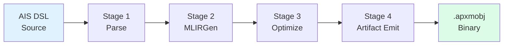
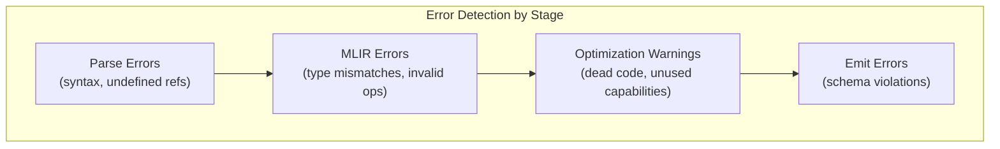

# Compilation Pipeline

The A-PXM compiler transforms AIS DSL source into an optimized, portable execution artifact. The pipeline has four stages, each with well-defined input and output formats, enabling independent testing and extension.

## Pipeline Overview



## Stage 1: Parse

**Input:** AIS DSL source text
**Output:** Abstract Syntax Tree (AST)

The parser performs:

1. **Lexing**: tokenize the source into AIS keywords, identifiers, literals, and operators.
2. **Parsing**: build a hierarchical AST from the token stream using a recursive-descent parser.
3. **Semantic validation**: check that all referenced capabilities exist in the AAM declaration, all variables are defined before use, and all type annotations are consistent.

Errors at this stage produce precise source locations and human-readable messages. The parser is designed to recover from common errors (missing semicolons, mismatched braces) and report multiple diagnostics in a single pass.

### AST Structure

The AST captures:
- **AAM declarations**: Beliefs, Goals, Capabilities with their types
- **Workflow blocks**: sequences of AIS instructions with data flow annotations
- **Subgraph definitions**: named blocks for BRANCH/SWITCH targets and TRY_CATCH scopes

## Stage 2: MLIRGen

**Input:** AST
**Output:** Unoptimized AIS MLIR dialect

MLIRGen lowers the AST into the AIS MLIR dialect, constructing typed operations with custom verifiers:

1. **Type inference**: resolve implicit types from context (e.g., inferring the output type of INV from the Capabilities map).
2. **Op construction**: create MLIR operations for each AIS instruction with full type annotations.
3. **Verifier attachment**: attach custom verification logic that checks AIS-specific invariants (latency budget ranges, capability existence, protocol validity).
4. **Region construction**: wrap subgraphs (TRY_CATCH scopes, BRANCH targets) in MLIR regions.

```mlir
// Example MLIRGen output
module @research_workflow {
  func.func @main(%ctx: !ais.context) -> !ais.value {
    %query = "ais.qmem"(%search_key, %session, %k) : (...) -> !ais.value
    %analysis = "ais.reason"(%prompt, %query) {
      latency_budget = 10000 : i64
    } : (!ais.string, !ais.value) -> !ais.future<!ais.string>
    %result = "ais.inv"(%summarize_tool, %analysis) : (...) -> !ais.future<!ais.tool_result>
    return %result : !ais.future<!ais.tool_result>
  }
}
```

## Stage 3: Optimize

**Input:** Unoptimized AIS MLIR
**Output:** Optimized AIS MLIR

The optimizer runs a configurable sequence of passes over the MLIR representation:

| Pass | Effect | Typical Improvement |
|------|--------|-------------------|
| **FuseAskOps** | Batch producer-consumer ASK chains into single calls | 1.29x fewer API calls |
| **CSE** | Eliminate redundant computations with identical inputs | Variable |
| **Dead-code elimination** | Remove operations whose results are never consumed | Reduces graph size |
| **Canonicalization** | Normalize operation patterns for consistent downstream handling | Enables further optimization |

Passes are composable and order-independent where possible. The optimizer iterates until a fixed point is reached (no pass makes further changes).

See [Optimization Passes](/compiler/optimization-passes) for detailed descriptions.

## Stage 4: Artifact Emit

**Input:** Optimized AIS MLIR
**Output:** `.apxmobj` binary artifact

The emitter serializes the optimized dataflow graph into a portable binary format:

1. **DAG serialization**: encode nodes (operations), edges (token flows), and subgraphs (regions) into a compact binary representation.
2. **Metadata embedding**: attach AAM declarations, capability schemas, and compilation flags.
3. **Entry point registration**: mark the top-level workflow entry points for the runtime loader.
4. **Schema packing**: include parameter schemas for runtime type checking of external inputs.
5. **Version stamping**: embed the artifact format version for backwards compatibility.

See [Artifact Format](/compiler/artifact-format) for the binary layout.

## Error Reporting

The compiler provides errors at the earliest possible stage:



Compared to runtime-only error detection (as in LangGraph), compile-time checking catches errors **49x faster** -- before any LLM call is made, before any tool is invoked, before any cost is incurred.

## CLI Usage

```bash
# Full pipeline: source to artifact
apxm compile workflow.ais -o workflow.apxmobj

# Parse only (syntax check)
apxm compile --stage=parse workflow.ais

# Emit MLIR for inspection
apxm compile --stage=mlir --emit-mlir workflow.ais

# Optimize and dump (debugging)
apxm compile --stage=optimize --dump-passes workflow.ais
```
