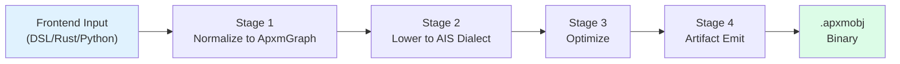
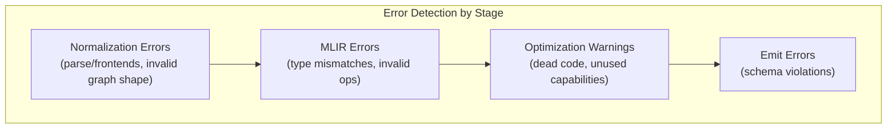

# Compilation Pipeline

The A-PXM compiler transforms canonical `ApxmGraph` input into an optimized, portable execution artifact. The pipeline has four stages, each with well-defined input and output formats, enabling independent testing and extension.

## Pipeline Overview


```mermaid
graph LR
    SRC["Frontend Input\n(DSL/Rust/Python)"] --> NORM["Stage 1\nNormalize to ApxmGraph"]
    NORM --> MLIR["Stage 2\nLower to AIS Dialect"]
    MLIR --> OPT["Stage 3\nOptimize"]
    OPT --> EMIT["Stage 4\nArtifact Emit"]
    EMIT --> OBJ[".apxmobj\nBinary"]

    style SRC fill:#e0f2fe
    style OBJ fill:#dcfce7
```

## Stage 1: Normalize to ApxmGraph

**Input:** Frontend source (AIS DSL AST, Rust builder graph, Python graph)
**Output:** Canonical `ApxmGraph`

The normalization layer performs:

1. **Frontend capture**: parse/collect frontend constructs.
2. **Graph construction**: map frontend constructs into `ApxmGraph` nodes/edges/parameters.
3. **Graph validation**: enforce canonical graph constraints (IDs, edge references, DAG checks, parameter integrity).

Errors at this stage produce human-readable diagnostics before any MLIR lowering or runtime execution.

### DSL Frontend Note

For AIS DSL specifically, frontend capture proceeds through AST iteration before graph construction:
- **AAM declarations**: Beliefs, Goals, Capabilities with their types
- **Workflow blocks**: sequences of AIS instructions with data flow annotations
- **Subgraph definitions**: named blocks for BRANCH/SWITCH targets and TRY_CATCH scopes

## Stage 2: Lower to AIS Dialect

**Input:** `ApxmGraph`
**Output:** Unoptimized AIS MLIR dialect

The lowering pipeline converts graph IR into AIS Dialect MLIR, constructing typed operations with custom verifiers:

1. **Type inference**: resolve implicit types from graph context.
2. **Op construction**: create MLIR operations for each AIS graph op with full type annotations.
3. **Verifier attachment**: attach custom verification logic that checks AIS-specific invariants (latency budget ranges, capability existence, protocol validity).
4. **Region construction**: wrap subgraphs (TRY_CATCH scopes, BRANCH targets) in MLIR regions.

```mlir
// Example lowerer output
module @research_workflow {
  func.func @main(%ctx: !ais.context) -> !ais.value {
    %query = "ais.qmem"(%search_key, %session, %k) : (...) -> !ais.value
    %analysis = "ais.reason"(%prompt, %query) {
      latency_budget = 10000 : i64
    } : (!ais.string, !ais.value) -> !ais.future<!ais.string>
    %result = "ais.inv"(%summarize_tool, %analysis) : (...) -> !ais.future<!ais.tool_result>
    return %result : !ais.future<!ais.tool_result>
  }
}
```

## Stage 3: Optimize

**Input:** Unoptimized AIS MLIR
**Output:** Optimized AIS MLIR

The optimizer runs a configurable sequence of passes over the MLIR representation:

| Pass | Effect | Typical Improvement |
|------|--------|-------------------|
| **FuseAskOps** | Batch producer-consumer ASK chains into single calls | 1.29x fewer API calls |
| **CSE** | Eliminate redundant computations with identical inputs | Variable |
| **Dead-code elimination** | Remove operations whose results are never consumed | Reduces graph size |
| **Canonicalization** | Normalize operation patterns for consistent downstream handling | Enables further optimization |

Passes are composable and order-independent where possible. The optimizer iterates until a fixed point is reached (no pass makes further changes).

See [Optimization Passes](optimization-passes.md) for detailed descriptions.

## Stage 4: Artifact Emit

**Input:** Optimized AIS MLIR
**Output:** `.apxmobj` binary artifact

The emitter serializes the optimized dataflow graph into a portable binary format:

1. **DAG serialization**: encode nodes (operations), edges (token flows), and subgraphs (regions) into a compact binary representation.
2. **Metadata embedding**: attach AAM declarations, capability schemas, and compilation flags.
3. **Entry point registration**: mark the top-level workflow entry points for the runtime loader.
4. **Schema packing**: include parameter schemas for runtime type checking of external inputs.
5. **Version stamping**: embed the artifact format version for backwards compatibility.

See [Artifact Format](/apxm/compiler/artifact-format) for the binary layout.

## Error Reporting

The compiler provides errors at the earliest possible stage:


```mermaid
graph TD
    subgraph Errors["Error Detection by Stage"]
        P["Normalization Errors\n(parse/frontends, invalid graph shape)"]
        M["MLIR Errors\n(type mismatches, invalid ops)"]
        O["Optimization Warnings\n(dead code, unused capabilities)"]
        E["Emit Errors\n(schema violations)"]
    end

    P --> M --> O --> E
```

Compared to runtime-only error detection (as in LangGraph), compile-time checking catches errors **49x faster** -- before any LLM call is made, before any tool is invoked, before any cost is incurred.

## CLI Usage

```bash
# Full pipeline: graph source to artifact
apxm compile workflow.json -o workflow.apxmobj

# Compile with no optimization passes
apxm compile workflow.json -o workflow.apxmobj -O0

# Compile with aggressive optimization
apxm compile workflow.json -o workflow.apxmobj -O3

# Emit compilation diagnostics JSON
apxm compile workflow.json -o workflow.apxmobj --emit-diagnostics compile_diagnostics.json
```

---

## References

1. C. Lattner and V. Adve, "LLVM: A Compilation Framework for Lifelong Program Analysis & Transformation," in *Proc. CGO '04*, IEEE, 2004. DOI: [10.1109/CGO.2004.1281665](https://doi.org/10.1109/CGO.2004.1281665)

2. C. Lattner et al., "MLIR: Scaling Compiler Infrastructure for Domain Specific Computation," in *Proc. CGO '21*, IEEE, 2021. DOI: [10.1109/CGO51591.2021.9370308](https://doi.org/10.1109/CGO51591.2021.9370308)

3. G. R. Gao, R. Patel, and T. St. John, "The Codelet Program Execution Model," presented at *WiA, ISCA '13*, Tel-Aviv, Israel, 2013.
