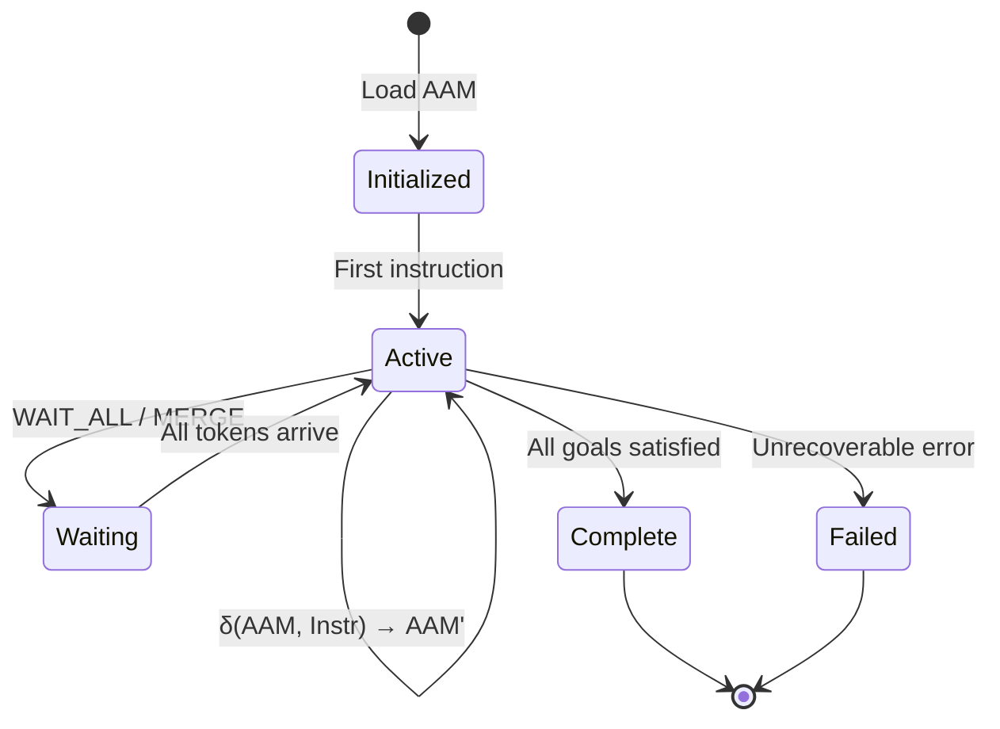
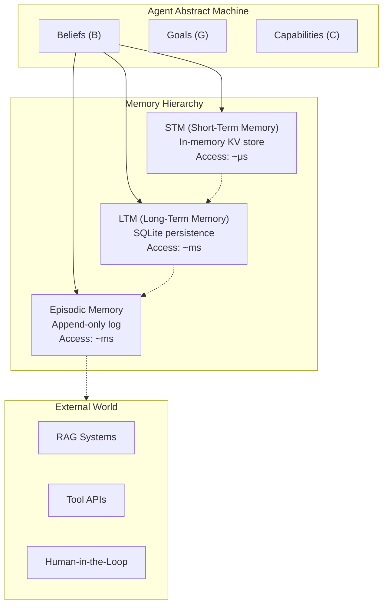

# Agent Abstract Machine (AAM)

The AAM defines **what an agent is** at any point in time. It is the state model that every AIS instruction reads from and writes to. Without a formal state model, agent behavior is scattered across Python closures, global variables, and implicit LLM context -- making it impossible to reason about, optimize, or verify.

## Formal Definition

An AAM is a triple:

```
AAM = (B, G, C)
```

| Component | Type | Description |
|-----------|------|-------------|
| **B** (Beliefs) | `Map<Key, TypedValue>` | What the agent currently knows -- a typed key-value store |
| **G** (Goals) | `PriorityQueue<Goal>` | What the agent is trying to achieve -- ordered by priority |
| **C** (Capabilities) | `Map<Name, Signature>` | What the agent can do -- typed function signatures for tools and sub-flows |

### Transition Function

Every AIS instruction is a state transition on the AAM:

```
δ(AAM, Instr) → AAM'
```

The transition function is **deterministic given the same inputs**: for a fixed AAM state and instruction, the resulting state is uniquely determined. Non-determinism (LLM sampling, tool failures) is captured in the typed return values, not in the transition mechanics.

## State Model



## Memory Hierarchy

The AAM's Beliefs are backed by a **three-tier memory hierarchy**, each tier optimized for different access patterns:



### Tier 1: Short-Term Memory (STM)

An in-memory key-value store providing microsecond access to recent context and tool output. STM is the working memory of the agent -- it holds the values most likely to be needed by the next few operations. STM is volatile; entries are evicted based on recency and relevance.

**Access pattern**: read-heavy, small values, high locality.

### Tier 2: Long-Term Memory (LTM)

A SQLite-backed persistent store for durable knowledge. LTM survives agent restarts and holds accumulated facts, preferences, and learned associations. Updates to LTM are transactional and trigger Belief updates in the AAM.

**Access pattern**: write-occasionally, read-on-demand, medium-to-large values.

### Tier 3: Episodic Memory

An append-only execution trace that records every operation the agent has performed, its inputs, outputs, and timing. Episodic memory is the substrate for the REFL (Reflect) instruction -- the agent can review its own history to identify patterns, errors, and improvement opportunities.

**Access pattern**: append-only writes, sequential reads during reflection.

### Tier 4: External World

Beyond the agent's own memory lies the external world: RAG systems for retrieval-augmented generation, tool APIs for actions, and human-in-the-loop interfaces for escalation. These are accessed through typed AIS instructions (INV, COMM) rather than direct memory operations.

## Concurrency Model

Each memory tier has an **independent lock**, allowing concurrent access across tiers. A FENCE instruction enforces ordering when cross-tier consistency is required. This design avoids global locking while maintaining correctness for operations that span tiers.

| Tier | Lock Granularity | Consistency |
|------|-----------------|-------------|
| STM | Per-key | Eventual (within agent) |
| LTM | Per-table | Transactional (SQLite) |
| Episodic | Append-only (no conflicts) | Sequential |

## Example: AAM State Snapshot

```
AAM = (
  B: {
    "user_query": String("What is the weather in Tokyo?"),
    "location":   String("Tokyo, JP"),
    "api_key":    Secret("sk-***"),
    "temperature": None  // not yet retrieved
  },
  G: [
    Goal("answer_user_query", priority=1),
    Goal("log_interaction", priority=2)
  ],
  C: {
    "weather_api": (location: String) → WeatherData,
    "summarize":   (data: WeatherData, query: String) → String
  }
)
```

After executing `INV weather_api(location)`, the transition function updates Beliefs:

```
B' = B ∪ { "temperature": Float(22.5) }
```

The rest of the AAM remains unchanged. This explicit, typed state model makes every mutation visible and auditable.
