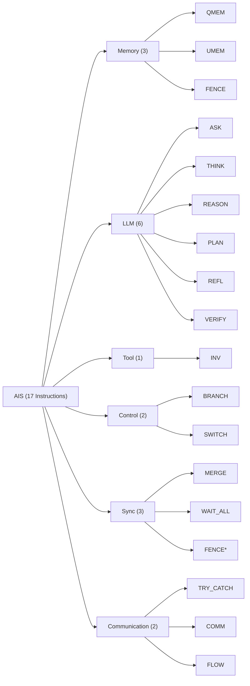

# Agent Instruction Set (AIS)

The AIS is a typed intermediate representation -- the "instruction set architecture" for agentic AI. Every operation takes typed inputs, produces typed outputs, and transitions the AAM state deterministically. The AIS is implemented as a custom MLIR dialect, inheriting MLIR's verification infrastructure, pass management, and optimization framework.

## Design Principles

1. **Typed end-to-end**: every operand and result carries a type. Type mismatches are caught at compile time, not at runtime after an expensive LLM call.
2. **Latency-aware**: LLM operations are stratified by latency budget (ASK ~1s, THINK ~3s, REASON ~10s), enabling the scheduler to make informed decisions about overlap and prioritization.
3. **Effect-explicit**: side effects (memory writes, tool calls, messages) are first-class operations, not hidden behind opaque function calls.
4. **Future-typed**: async operations return `Future<T>` handles that integrate with the dataflow token system.

## Instruction Categories



<Note>FENCE appears in both Memory and Sync categories -- it enforces memory ordering, which is both a memory and a synchronization concern.</Note>

## Complete Instruction Table

| Mnemonic | Instruction | Operands | Result Type | Description |
|----------|-------------|----------|-------------|-------------|
| `QMEM` | QueryMemory | `q: String, sid: SessionID, k: Int` | `Value` | Retrieve from tiered memory (STM → LTM → Episodic) |
| `UMEM` | UpdateMemory | `data: Value, sid: SessionID` | `Void` | Persist data to memory; update AAM Beliefs |
| `ASK` | Ask | `prompt: String, ctx: Context` | `String` | Fast LLM query (~1s latency budget) |
| `THINK` | Think | `prompt: String, ctx: Context` | `String` | Medium LLM reasoning (~3s latency budget) |
| `REASON` | Reason | `prompt: String, ctx: Context` | `String` | Deep LLM reasoning (~10s latency budget) |
| `PLAN` | Plan | `goal: Goal, ctx: Context` | `PlanTree` | Structured goal decomposition for downstream scheduling |
| `REFL` | Reflect | `trace: EpisodicTrace, ctx: Context` | `Critique` | Self-critique over episodic execution trace |
| `VERIFY` | Verify | `claim: String, evidence: Value` | `Verdict` | Validate claim against evidence; typed verdict token |
| `INV` | InvokeTool | `tool: CapName, params: Params` | `ToolResult` | Call external tool with typed parameter marshalling |
| `BRANCH` | BranchOnValue | `tok: Token, val: Value, lblT: Label, lblF: Label` | `Void` | Conditional branch: if `tok == val` goto `lblT` else `lblF` |
| `SWITCH` | Switch | `disc: Value, cases: [(Value, Label)]` | `Void` | Multi-way branch on discriminant value |
| `MERGE` | Merge | `tokens: List<Token>` | `Token` | Synchronize parallel paths into single token |
| `WAIT_ALL` | WaitAll | `tokens: List<Token>` | `List<Value>` | Block until all input tokens are available |
| `FENCE` | Fence | `--` | `Void` | Memory barrier: all prior writes visible before subsequent reads |
| `TRY_CATCH` | TryCatch | `trySubg: Subgraph, catchSubg: Subgraph` | `Value` | Exception handling with recovery subgraph |
| `COMM` | Communicate | `rcpt: AgentID, msg: Message, prot: Protocol` | `Ack` | Send typed message to recipient agent |
| `FLOW` | FlowCall | `agent: AgentID, flow: FlowName, args: Args` | `Future<Value>` | Cross-agent flow invocation; returns future handle |

## Latency-Typed LLM Operations

A distinguishing feature of AIS is that LLM operations carry explicit latency budgets:

| Operation | Budget | Use Case | Example |
|-----------|--------|----------|---------|
| `ASK` | ~1s | Classification, extraction, simple Q&A | "Is this email spam?" |
| `THINK` | ~3s | Multi-step reasoning, summarization | "Summarize this document and extract key claims" |
| `REASON` | ~10s | Complex analysis, planning, synthesis | "Analyze these 5 reports and identify contradictions" |

The scheduler uses these budgets to:
- **Overlap** long-running REASON operations with independent ASK/THINK operations
- **Prioritize** operations on the critical path
- **Timeout** operations that exceed their budget, triggering TRY_CATCH recovery

## Future and Handle Types

Async operations return `Future<T>` handles that participate in the dataflow token system:

```
%result = ais.ask(%prompt, %ctx) : Future<String>
%tool_out = ais.inv("search", %params) : Future<ToolResult>

// WAIT_ALL consumes futures, produces resolved values
%values = ais.wait_all(%result, %tool_out) : (String, ToolResult)
```

Futures are first-class tokens: they flow along DAG edges, trigger downstream operations when resolved, and carry type information for compile-time verification.

## MLIR Dialect

AIS is implemented as an MLIR dialect with custom operations, types, and verifiers:

```mlir
// Example: AIS MLIR dialect operation
%0 = "ais.ask"(%prompt, %ctx) {
  latency_budget = 1000 : i64,
  model = "default"
} : (!ais.string, !ais.context) -> !ais.future<!ais.string>
```

Each operation carries:
- **Custom verifiers** that check operand types and structural constraints
- **Canonicalization patterns** for normalization
- **Folding rules** for compile-time evaluation of constant expressions
