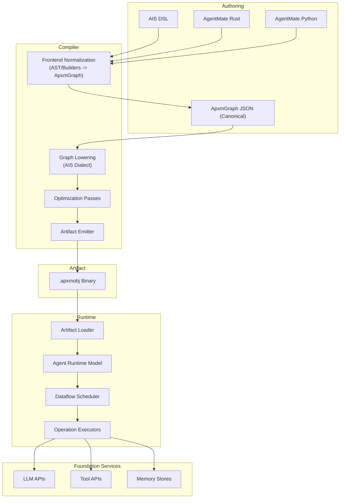
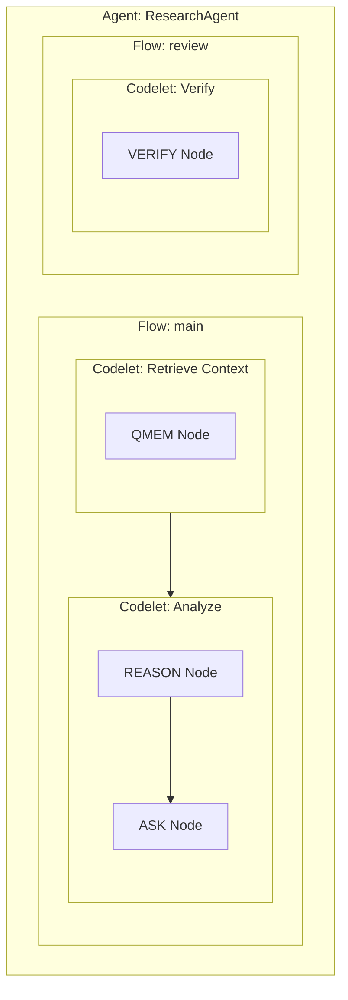
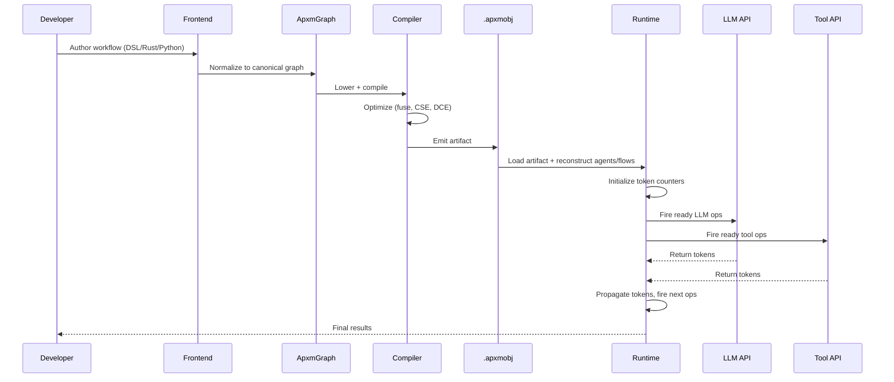

# Architecture

A-PXM is a vertically integrated system. All frontends normalize into `ApxmGraph` (canonical IR), then lower to the AIS Dialect and execute on a dataflow scheduler that automatically extracts parallelism from dependencies.

## Full Stack

## Component Overview

### Frontends + Canonical IR

APXM accepts multiple authoring frontends:
- AIS DSL
- AgentMate Rust builders/macros
- AgentMate Python graph layer

All frontend inputs are normalized to `ApxmGraph` as the canonical compile input format.

### Compiler Pipeline

The compiler transforms canonical graph IR into an optimized execution artifact in four stages:

| Stage | Input | Output | Key Operations |
|-------|-------|--------|----------------|
| **Normalize** | Frontend input | `ApxmGraph` | AST iteration (DSL), builder capture (Rust/Python), graph validation |
| **Lower** | `ApxmGraph` | AIS MLIR dialect | Graph-to-MLIR lowering, op attribute mapping, verifier checks |
| **Optimize** | Unoptimized AIS MLIR | Optimized AIS MLIR | FuseAskOps, CSE, dead-code elimination, canonicalization |
| **Emit** | Optimized MLIR | `.apxmobj` binary | DAG serialization, metadata embedding, schema packing |

### Artifact

The `.apxmobj` file is a portable, versioned binary containing the serialized dataflow graph, operation metadata, entry points, and parameter schemas. It can be loaded by any conforming A-PXM runtime.

### Runtime Agent Model

At runtime, agents are now represented as first-class structures (`Agent`, `AgentFlow`, `AgentMetadata`) rather than inferred only from flow name strings. The runtime reconstructs:

**Agent -> Flows -> Codelets -> Nodes**

and registers each agent in `FlowRegistry`, while keeping legacy `(agent, flow) -> ExecutionDag` lookups for `FLOW_CALL` operations.

### Dataflow Scheduler

The runtime's core: a token-based scheduler that tracks pending input counts for each operation. When a token arrives at an operation, its counter is decremented; when the counter reaches zero, the operation is enqueued for execution. This provides O(1) readiness detection without graph traversal.

### Operation Executors

Typed executors for each AIS instruction category:

- **Memory executor**: handles QMEM, UMEM, FENCE against the three-tier memory hierarchy
- **LLM executor**: dispatches ASK, THINK, REASON, PLAN, REFLECT, VERIFY to model APIs with latency budgets
- **Tool executor**: invokes external tools via INV with typed parameter marshalling
- **Control executor**: evaluates BRANCH_ON_VALUE and SWITCH for conditional routing
- **Sync executor**: manages MERGE, WAIT_ALL for parallel path synchronization
- **Communication executor**: handles COMMUNICATE and FLOW_CALL for multi-agent messaging

## Data Flow Through the Stack

## Design Principles

1. **Separation of concerns**: frontends describe intent; canonical graph captures structure; compiler decides strategy; runtime handles tactics.
2. **Type safety end-to-end**: from frontend authoring through graph validation and AIS MLIR verification to runtime token passing, every value is typed.
3. **Automatic parallelism**: developers never write `async`/`await`. The DAG structure makes independence explicit; the scheduler exploits it.
4. **Portability**: the `.apxmobj` artifact is runtime-agnostic. Different schedulers (single-machine, distributed, GPU-offloaded) can execute the same artifact.
5. **Observability**: every operation produces typed tokens that flow through the DAG, creating a complete, structured execution trace for debugging and reflection.

---

## References

1. C. Lattner and V. Adve, "LLVM: A Compilation Framework for Lifelong Program Analysis & Transformation," in *Proc. CGO '04*, IEEE, 2004. DOI: [10.1109/CGO.2004.1281665](https://doi.org/10.1109/CGO.2004.1281665)

2. C. Lattner et al., "MLIR: Scaling Compiler Infrastructure for Domain Specific Computation," in *Proc. CGO '21*, IEEE, 2021. DOI: [10.1109/CGO51591.2021.9370308](https://doi.org/10.1109/CGO51591.2021.9370308)

3. J. R. Gurd, C. C. Kirkham, and I. Watson, "The Manchester Prototype Dataflow Computer," *Communications of the ACM*, vol. 28, no. 1, pp. 34–52, 1985. DOI: [10.1145/2465.2468](https://doi.org/10.1145/2465.2468)

4. G. R. Gao, R. Patel, and T. St. John, "The Codelet Program Execution Model," presented at *WiA, ISCA '13*, Tel-Aviv, Israel, 2013.

5. R. D. Blumofe and C. E. Leiserson, "Scheduling Multithreaded Computations by Work Stealing," *JACM*, vol. 46, no. 5, pp. 720–748, 1999. DOI: [10.1145/324133.324234](https://doi.org/10.1145/324133.324234)
