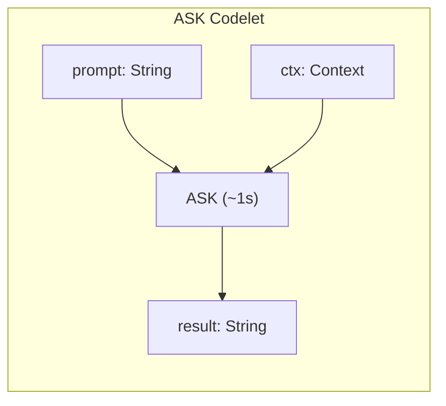
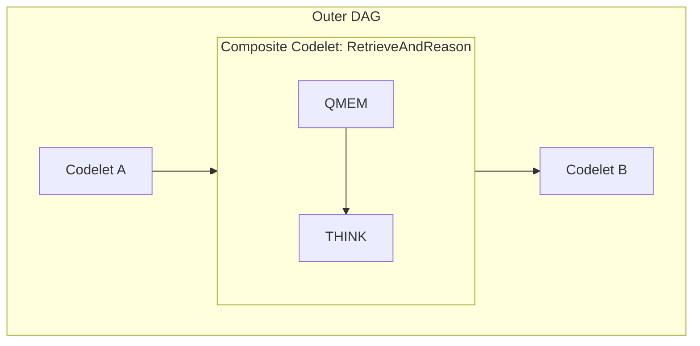
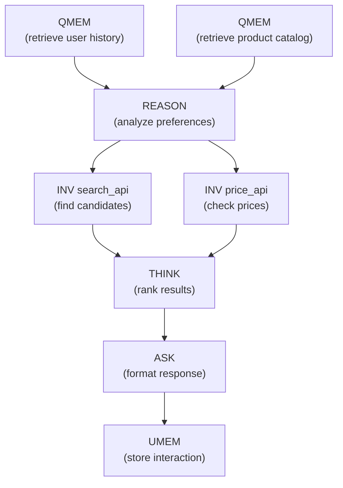
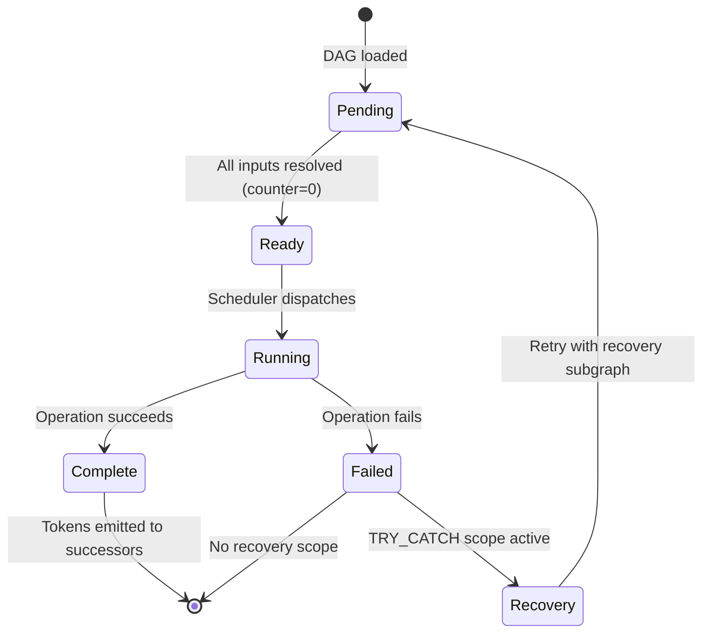

# Codelets

A **codelet** is the fundamental unit of work in A-PXM. It encapsulates a single atomic operation -- an LLM call, a tool invocation, a memory access, or a composition of these -- along with its typed inputs, outputs, and firing conditions. Codelets are the nodes in the dataflow graph.

## Codelet as Compilable Unit

A codelet is the **minimum compilable unit of AI work**. It sits at the critical point on the compilation spectrum:

- **Below a codelet** (individual AIS instructions like ASK, INV, QMEM): interpreted by the runtime with no optimization opportunity. The runtime dispatches them one at a time.
- **At codelet level**: the compiler has enough context to analyze dependencies, estimate latencies, assign priorities, and generate an optimized execution plan.
- **Above a codelet** (CodeletDag): more optimization surface — the compiler can reorder, parallelize, and fuse across codelet boundaries.

The compilation spectrum runs: **single instruction → codelet → CodeletDag**. A codelet is where interpretation ends and optimization begins.

## Three Sources of Codelets

Codelets can originate from three distinct sources, all converging on the same compilation and execution pipeline:

1. **Developer-authored** — Written directly using the builder API (`Codelet::new(...)`) or declared in APXM graph definitions. These are static, checked at compile time, and represent the most common path.

2. **User-authored (JSON)** — Submitted as JSON payloads (e.g., from a web UI or API call) and deserialized via `CodeletDag::from_json()`. This enables non-developer users to define workflows without writing code.

3. **Agent-generated (tool-use / PLAN instruction)** — Created at runtime by agents using the `create_codelet` and `compile_codelet_dag` tools. The PLAN instruction's `codelet_dag` field also allows agents to express multi-step plans as codelets.

Regardless of source, all codelets follow the same path: **CodeletDag → compile → ExecutionDag → Runtime**.

## Definition

A codelet consists of:

| Field | Type | Description |
|-------|------|-------------|
| `id` | `CodeletID` | Unique identifier within the DAG |
| `op` | `AIS Instruction` | The operation to perform (ASK, INV, MERGE, etc.) |
| `inputs` | `List<(EdgeID, Type)>` | Typed input edges with expected token types |
| `outputs` | `List<(EdgeID, Type)>` | Typed output edges with produced token types |
| `pending` | `AtomicInt` | Counter of unresolved input tokens |
| `priority` | `Int` | Scheduling priority (higher = sooner when multiple codelets are ready) |

## Firing Rule

A codelet fires when **all** its input tokens are available:

```
fire(codelet) ⟺ codelet.pending == 0
```

This is the dataflow firing rule. Independent codelets with no shared edges fire in parallel without any explicit concurrency primitives.

## Codelet Types

### Primitive Codelets

A primitive codelet wraps a single AIS instruction:



### Composite Codelets

A composite codelet encapsulates a sub-DAG, presenting a single-node interface to the outer graph. This enables hierarchical composition:



Composite codelets are the compilation target for reusable agent sub-routines. The compiler can inline them for optimization or keep them opaque for modularity.

## CodeletDag

A **CodeletDag** is the top-level execution graph: a directed acyclic graph of codelets connected by typed edges. It is the artifact that the compiler produces and the runtime consumes.

`CodeletDag` supports JSON serialization via `to_json()` and `from_json()` for storage, transmission, and dynamic loading. It can also bypass the full `ApxmGraph` compilation pipeline via `to_execution_dag()`, which directly lowers the codelet DAG into an `ExecutionDag` suitable for runtime dispatch.



In this DAG:
- **C1** and **C2** fire in parallel (no shared dependency)
- **C4** and **C5** fire in parallel (both depend only on C3)
- **C6** waits for both C4 and C5 (fan-in synchronization)
- The critical path is C1/C2 -> C3 -> C4/C5 -> C6 -> C7 -> C8

## Codelet Boundary Preservation

When a `CodeletDag` is lowered to an `ExecutionDag` via `to_execution_dag()`, each generated execution node records the codelet it originated from in its `NodeMetadata`:

```rust
pub struct NodeMetadata {
    pub priority: u32,
    pub estimated_latency: Option<u64>,
    pub codelet_source_id: Option<CodeletId>,  // ← source codelet
}
```

The `codelet_source_id` field is preserved through the wire format (serialization/deserialization) and survives all the way to runtime execution. This enables:

- **Codelet-level tracing** — aggregate execution metrics (latency, token usage) back to the original codelet, regardless of how many execution nodes it was expanded into.
- **Codelet-level error reporting** — when an execution node fails, the error can be attributed to a specific codelet by name and ID, giving meaningful diagnostics to developers and users.
- **Boundary-aware optimization** — the compiler can reason about codelet boundaries when deciding whether to fuse or split execution nodes.

## Scheduling and Priority

When multiple codelets are ready simultaneously, the scheduler uses the `priority` field to determine execution order. Priority is assigned by the compiler based on:

1. **Critical path membership**: codelets on the critical path get higher priority
2. **Latency budget**: high-latency operations (REASON) are dispatched early to maximize overlap
3. **Fan-out degree**: codelets that unblock many downstream operations are prioritized

## Intellectual Heritage

The codelet abstraction draws on two traditions:

### HPC Dataflow

Gao et al.'s work on dataflow architectures (the Manchester Dataflow Machine, MIT Tagged-Token Architecture) established the principle that computation should be driven by data availability, not program counters. A-PXM applies this principle to AI workloads where the "instructions" are LLM calls with seconds of latency rather than ALU operations with nanoseconds.

### Cognitive Science

Baars and Franklin's **Global Workspace Theory** (GWT) models cognition as a collection of specialized processors ("codelets") that compete for access to a shared workspace. Winning codelets broadcast their results, triggering further processing. A-PXM's codelets mirror this structure: independent specialized operations that produce tokens consumed by downstream processors, with the dataflow graph serving as the global workspace.

## Codelet Lifecycle


