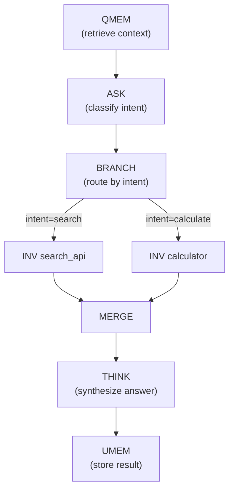
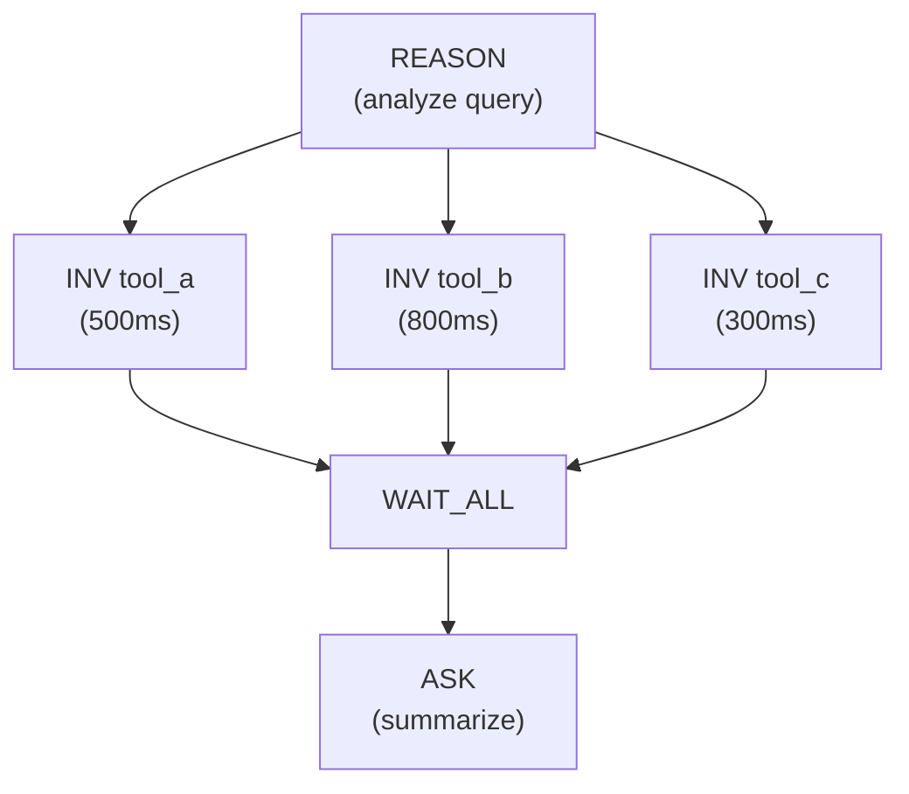
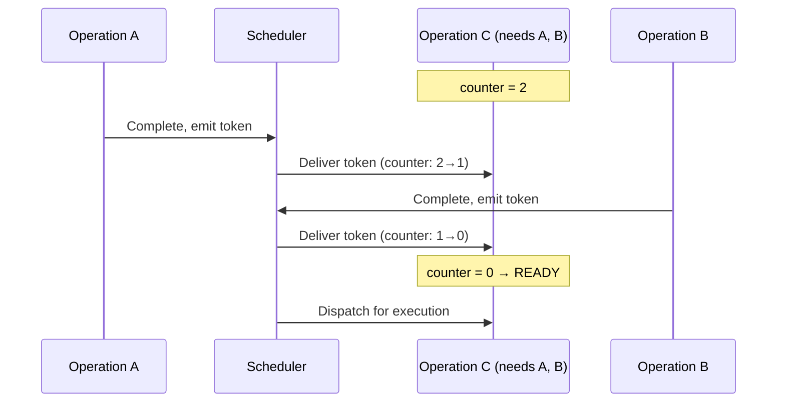

# Dataflow Execution

A-PXM replaces the conventional program-counter model with **dataflow execution**: operations fire when all their input data is available, not when a sequential counter reaches them. This is the mechanism that eliminates the agentic von Neumann bottleneck.

## From Plans to Graphs

The compiler transforms an AIS program into a **dataflow graph**:

- **Nodes** are AIS instructions (ASK, INV, MERGE, etc.)
- **Edges** are data tokens carrying typed values between operations
- **Firing rule**: a node executes when ALL input tokens are present

## Automatic Parallelism

The critical insight: **independence is structural**. If two nodes have no edge between them, they are independent and can execute in parallel. The developer never writes `async`, `await`, `Promise.all`, or thread management code -- parallelism falls out of the graph topology.

### Example: Fan-Out / Fan-In

Sequential execution: 500 + 800 + 300 = **1600ms** for the tool calls alone.
Dataflow execution: max(500, 800, 300) = **800ms** -- a 2x speedup with zero developer effort.

In practice, the gains compound across deeper graphs with more independent subpaths.

## Token-Based Scheduling

The runtime implements dataflow scheduling with a **token counter** per operation:

1. At load time, each operation's counter is initialized to its **number of input edges**.
2. When a predecessor completes, it sends a token along each outgoing edge.
3. Receiving a token decrements the target operation's counter.
4. When a counter reaches zero, the operation is **ready** and is placed on the execution queue.

This provides **O(1) readiness detection**: no graph traversal, no dependency resolution at fire time. The scheduler simply checks `counter == 0`.

## Token Semantics

Tokens carry typed values along edges:

| Token Size | Transport | Rationale |
|-----------|-----------|-----------|
| Small (< 4KB) | **By value** | Strings, numbers, small JSON -- copied directly in the token |
| Large (>= 4KB) | **By reference** | Documents, images, embeddings -- token carries a shared memory handle |

The threshold is configurable. By-value transport avoids indirection for the common case (most LLM outputs are small strings), while by-reference transport prevents copying large payloads.

## Comparison with Sequential Execution

| Property | Sequential (call-at-a-time) | Dataflow (A-PXM) |
|----------|---------------------------|-------------------|
| Parallelism | Manual (`async`/`await`) | Automatic from graph structure |
| Scheduling | Program counter | Token counters |
| Wall time | Sum of all operations | Critical path through DAG |
| Error isolation | Stack unwinding | Scoped to subgraph (TRY_CATCH) |
| Observability | Log statements | Typed token trace |

## Critical Path Optimization

The dataflow model enables the compiler and runtime to reason about the **critical path** -- the longest chain of dependent operations through the DAG. Optimization passes can:

- **Fuse** operations on the critical path to reduce token overhead
- **Prefetch** data for operations predicted to fire next
- **Reorder** independent operations to overlap high-latency ops with low-latency ones

This is impossible in sequential execution, where every operation is on the critical path by definition.
