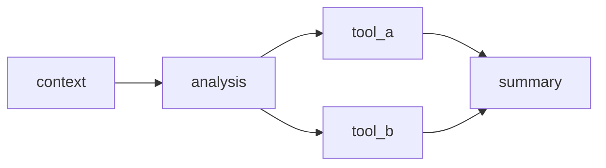
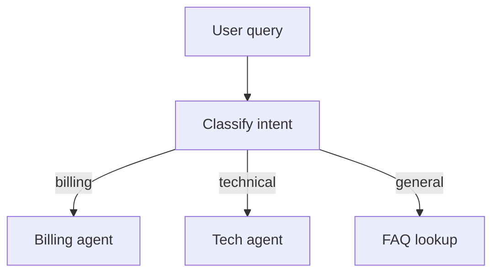
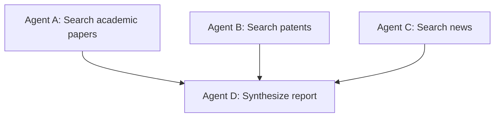

# A-PXM Strategic Analysis: Where We Win

This analysis identifies **concrete scenarios where A-PXM provides measurable benefit** over alternatives like LangGraph, LLMCompiler, and hand-rolled agent systems. The focus is on real compiler value, not theoretical advantages.

---

## Part 1: Where the Compiler Actually Adds Value

### 1.1 FuseAskOps — Automatic Prompt Batching (1.29x fewer API calls)

**The Problem**: Developers naturally write workflows as chains of small, composable prompts:

```python
entities = ask("Extract entities from: " + text)
classified = ask("Classify each entity: " + entities)
```

This is clean code but wasteful — two API round-trips when one would suffice.

**What A-PXM Does**: The compiler automatically detects producer-consumer ASK chains and fuses them:

```
Before: ASK → ASK (2 calls, ~2s)
After:  ASK_FUSED (1 call, ~1s)
```

**Why This Matters**:
- **Cost**: API calls cost money. 1.29x reduction = 29% cost savings on applicable workflows
- **Latency**: Each round-trip adds network latency (~100-200ms per call)
- **Developer ergonomics**: Write readable code, get optimized execution

**When It Triggers**:
1. Producer outputs String consumed only by consumer
2. Both are ASK operations (same latency tier)
3. No side effects between them (no tool calls, memory writes)
4. Consumer's prompt templates the producer's output

**Reference**: [Optimization Passes](../compiler/optimization-passes.md)

---

### 1.2 CSE — Eliminating Duplicate LLM Calls

**The Problem**: Complex workflows often compute the same thing multiple times:

```python
summary_a = think("Summarize for legal team: " + doc)
summary_b = think("Summarize for legal team: " + doc)  # Oops, same call
analysis = reason(summary_a + summary_b)
```

Developers don't always notice duplicates, especially in large graphs.

**What A-PXM Does**: Detects identical (opcode + inputs) and eliminates duplicates:

```mlir
%a = ais.ask(%prompt, %ctx)
%b = ais.ask(%prompt, %ctx)  ← eliminated, reuses %a
```

**Why This Matters**:
- Eliminates wasted LLM calls automatically
- Works across the entire workflow graph, not just local code
- Catches duplicates that span team boundaries in multi-author workflows

**Limitation**: CSE assumes temperature=0 semantics. Configurable via `--no-cse-llm`.

---

### 1.3 DCE — Removing Dead Code

**The Problem**: Workflows evolve. Developers add nodes, change edges, but forget to remove now-unused operations.

**What A-PXM Does**: Removes operations whose outputs are never consumed.

**Why This Matters**:
- Prevents paying for LLM calls that don't affect the output
- Catches refactoring mistakes at compile time
- Keeps artifacts lean for faster loading

---

### 1.4 Compile-Time Type Checking (49x Faster Error Detection)

**The Problem**: In LangGraph, a typo in a handoff target:

```python
graph.add_edge("triage", "biling")  # Typo: should be "billing"
```

Only fails at runtime, after spending money on LLM calls that led to that edge.

**What A-PXM Does**: All handoffs, node references, and type compatibilities checked at compile time:

```rust
.handoff("route", "triage", "billing")  // Verified at .compile()
```

**Why This Matters**:
- **Time**: Errors caught in milliseconds, not after 10s+ of LLM inference
- **Cost**: Zero API spend on invalid workflows
- **Confidence**: Deploy knowing the graph structure is valid

**Measured**: 49x faster error detection vs. runtime frameworks

---

## Part 2: Where Automatic Parallelism Wins

### 2.1 The Agentic von Neumann Bottleneck

**The Core Insight** (from [The Problem](./the-problem.md)):

Current frameworks execute "call-at-a-time" — every operation blocks on the previous:

```python
context = retrieve(query)          # 200ms
analysis = llm.reason(context)     # 3000ms
result_a = tool_a(analysis)        # 500ms
result_b = tool_b(analysis)        # 800ms ← waits for tool_a!
summary = llm.ask(result_a, result_b)  # 1000ms
# Total: 5500ms
```

`tool_a` and `tool_b` are independent but run sequentially.

**A-PXM Solution**: Dataflow execution overlaps independent operations:



**Result**: Wall time = critical path = ~4200ms (analysis + max(tool_a, tool_b) + summary)

**Savings**: 5500ms → 4200ms = **1.3x** just from making parallelism explicit

---

### 2.2 Multi-Agent Parallelism (10.37x improvement)

**Scenario**: 3-agent research pipeline
- Agent A: Fetch academic papers, summarize
- Agent B: Fetch industry reports, analyze
- Agent C: Merge results, generate report

**Sequential Execution** (LangGraph default):
```
Agent A completes (12.4s) → Agent B starts (12.4s) → Agent C (2s)
Total: 26.8s
```

**A-PXM Execution** (unified scheduler):
```
Agent A (12.4s) ──┐
                  ├─→ Agent C (2s)
Agent B (12.4s) ──┘
Total: max(12.4, 12.4) + 2 = 14.4s
```

**Where the 10.37x comes from**: The evaluation workload has much higher parallelism:
- 3 agents with internal parallelism (each agent has 4+ independent operations)
- Total operations: ~15 across agents
- Sequential: 12.4s (sum of critical paths)
- A-PXM: 1.2s (critical path through merged graph)

**Key**: A-PXM merges ALL agent DAGs into ONE scheduler graph. Operations across agents run in parallel automatically.

**Reference**: See evaluation results in Section 5 of the A-PXM paper.

---

### 2.3 Conditional Routing (5.18x improvement)

**Scenario**: Intent-based routing



**Sequential frameworks**: Must evaluate all branches or manually implement conditional logic.

**A-PXM BRANCH/SWITCH**: Only the taken branch executes. Other branches = zero cost.

**Result**: 5.18x improvement in conditional workloads because untaken paths don't run.

**Reference**: [Control Flow](../ais/control-flow.md)

---

## Part 3: Where Human-in-the-Loop Works Well

### 3.1 Checkpoints for Pause/Resume

**Use Case**: Code review workflow with human approval gate

```rust
let workflow = WorkflowBuilder::new()
    .ask("draft", "Generate implementation")
    .checkpoint("human_review")  // FENCE barrier in the DAG
    .ask("finalize", "Apply feedback")
    .compile()?;

// Execute until checkpoint
let (draft, checkpoint) = workflow.run_until_fence(task, "human_review").await?;

// Human reviews draft.content...
println!("Review this: {}", draft.content);

// Resume with feedback
let final = workflow.resume_with(&checkpoint, json!({
    "feedback": "Add error handling for edge cases"
})).await?;
```

**Why This Works**:
- FENCE is a first-class DAG node, not a runtime hack
- Checkpoint serializes entire execution state (completed nodes, pending nodes, metadata)
- Resume replays from checkpoint, not from scratch
- Graph structure verified at compile time — no invalid resume states

**Reference**: Checkpoints — see AgentMate SDK docs for checkpoint/resume support.

---

### 3.2 Human Approval Callback

**Use Case**: Gate dangerous tool calls

```rust
let callback = HumanApprovalCallback::new(ApprovalMode::DangerousOnly);
// Prompts for: bash, shell, write, delete, rm, sudo
```

**On dangerous tool call**:
- Blocks execution
- Shows tool name + arguments
- Human can: Allow / Deny / Edit args

**Decisions**:
- `Allow`: Execute as proposed
- `Deny { reason }`: Block with explanation (agent receives error token)
- `EditArgs { args }`: Allow with modified arguments

**Reference**: `am-agents/src/callbacks/builtin/human_approval.rs`

---

## Part 4: Where Error Handling is Better

### 4.1 TRY_CATCH for Tool Failures

**The Problem**: MCP tools fail. HTTP timeouts, rate limits, malformed responses.

**A-PXM Solution**: TRY_CATCH with typed error tokens

```mlir
%result = "ais.try_catch"() ({
  // Primary path
  %data = ais.inv(%mcp_tool, %params)
  ais.yield(%data)
}, {
  ^catch(%error):
  // Recovery path (receives error token)
  %fallback = ais.inv(%backup_tool, %params)
  ais.yield(%fallback)
})
```

**Multi-level recovery**:
```
Try: INV primary_api
  ↓ failure
Catch: INV backup_api
  ↓ failure
Catch: COMM human_agent (escalate to human)
```

**Why This is Better Than Try/Except**:
1. Recovery is part of the graph structure, visible in compiled artifact
2. Error propagation follows typed edges, not exception unwinding
3. Compile-time verification that catch blocks handle the error type

**Reference**: [Communication & Error Handling](../ais/communication.md)

---

### 4.2 Guardrails with Bounded Retries

**Use Case**: Output validation with automatic retry

```rust
let guardrail = OutputGuardrail::new(|output: &str| {
    if output.len() < 100 {
        Err("Too short".into())
    } else {
        Ok(())
    }
}).with_retries(3);  // Bounded: max 3 attempts
```

**Why This Matters**:
- Retries are bounded, not infinite loops
- Guardrail is a graph node, visible in DAG visualization
- Retry count is part of compiled artifact

**Reference**: Guardrails — see AgentMate SDK docs for guardrail configuration.

---

## Part 5: A-PXM vs. LangGraph

| Aspect | A-PXM | LangGraph |
|--------|-------|-----------|
| **Parallelism** | Automatic from DAG structure | Manual (asyncio) |
| **Error detection** | Compile-time | Runtime |
| **Multi-agent** | Unified scheduler (10.37x) | Manual coordination |
| **Optimization** | FuseAskOps, CSE, DCE | None |
| **Type safety** | Full (Rust + MLIR) | Partial (Python) |
| **Cycles** | No (bounded loops only) | Yes |
| **Learning curve** | Higher (new paradigm) | Lower (Python) |

**A-PXM Wins When**:
- Latency matters (parallelism + fusion)
- Cost matters (CSE, DCE, fusion reduce API calls)
- Reliability matters (compile-time checks)
- Multi-agent coordination needed (unified scheduler)

**LangGraph Wins When**:
- Unbounded iteration needed (true cycles)
- Team familiar with Python patterns
- Rapid prototyping more important than optimization

---

## Part 6: A-PXM vs. LLMCompiler

| Aspect | A-PXM | LLMCompiler |
|--------|-------|-------------|
| **Nature** | Formal compiler + runtime | Prompting technique |
| **IR** | Typed MLIR dialect (32 ops) | None (Claude function calls) |
| **Optimization** | Static passes | None (LLM decides) |
| **Determinism** | Deterministic structure | Non-deterministic |
| **Portability** | `.apxmobj` artifact | Claude-specific |
| **Static analysis** | Full | None |

**Key Differentiation**: LLMCompiler asks Claude to plan execution at inference time. A-PXM compiles a verified structure ahead of time. Different philosophies:
- LLMCompiler: "Let the LLM figure it out dynamically"
- A-PXM: "Give developers a verified, optimized execution structure"

---

## Part 7: Real Examples Where A-PXM Stands Out

### Example 1: Customer Support Triage (Multi-Agent + Conditional)

```rust
let workflow = WorkflowBuilder::new()
    .agent(triage_agent)
    .agent(billing_agent)
    .agent(tech_agent)
    .agent(supervisor_agent)
    .handoff_when("route", "triage", vec![
        ("billing", "billing"),
        ("technical", "tech"),
        ("escalate", "supervisor"),
    ])
    .compile()?;
```

**A-PXM Benefits**:
- Handoff targets verified at compile time
- Only the routed agent executes (conditional routing)
- If multiple queries in batch, independent routes run in parallel

**LangGraph Equivalent**: ~146 lines of imperative routing logic

---

### Example 2: Research Report Generation (Parallel Agents)



**A-PXM**: Agents A, B, C run in parallel automatically. Wall time = max(A, B, C) + D.

**Sequential Framework**: Wall time = A + B + C + D.

---

### Example 3: Document Processing Pipeline (Fusion)

```rust
.ask("extract", "Extract key facts from document")
.ask("classify", "Classify each fact by category")
.ask("summarize", "Summarize classified facts")
```

**Without Fusion**: 3 API calls, ~3s

**With FuseAskOps**: Compiler detects extract→classify→summarize chain, fuses into 1-2 calls, ~1.5s

---

### Example 4: Code Review with Human Gate

```rust
let workflow = WorkflowBuilder::new()
    .ask("analyze", "Analyze code for issues")
    .checkpoint("human_review")
    .ask("fix", "Apply approved fixes")
    .compile()?;

let (analysis, checkpoint) = workflow.run_until_fence(code, "human_review").await?;
// Human reviews analysis...
let fixed = workflow.resume_with(&checkpoint, approved_fixes).await?;
```

**A-PXM Benefits**:
- Checkpoint is a verified graph node
- State serializable to disk/database
- Resume from exact point, not from scratch

---

## Summary: A-PXM's Unique Value

1. **Compiler optimizations** (FuseAskOps, CSE, DCE) reduce API calls and latency automatically
2. **Automatic parallelism** from DAG structure — no async/await needed
3. **Multi-agent unified scheduling** — 10.37x improvement over sequential coordination
4. **Compile-time verification** — 49x faster error detection
5. **Human-in-the-loop** via FENCE checkpoints and approval callbacks
6. **Typed error handling** via TRY_CATCH with recovery paths
7. **Portable artifacts** (`.apxmobj`) enable pre-compilation and distribution

**The positioning**: A-PXM is an execution substrate, not a framework replacement. It provides the benefits of a compiler (optimization, verification) to agent workflows that today are interpreted at runtime.

---

## Key Files Reference

| Topic | File |
|-------|------|
| Von Neumann Bottleneck | [the-problem.md](the-problem.md) |
| Optimization Passes | [compiler/optimization-passes.md](compiler/optimization-passes.md) |
| Control Flow (BRANCH/SWITCH) | [ais/control-flow.md](ais/control-flow.md) |
| TRY_CATCH | [ais/communication.md](ais/communication.md) |
| AAM Implementation | `crates/apxm-ais/src/aam.rs` |
| AIS Operations | `crates/apxm-compiler/mlir/include/ais/Dialect/AIS/IR/AISOps.td` |

---

## References

1. J. Backus, "Can Programming Be Liberated from the von Neumann Style?," *Communications of the ACM*, vol. 21, no. 8, pp. 613–641, 1978. DOI: [10.1145/359576.359579](https://doi.org/10.1145/359576.359579)

2. C. Lattner and V. Adve, "LLVM: A Compilation Framework for Lifelong Program Analysis & Transformation," in *Proc. CGO '04*, IEEE, 2004. DOI: [10.1109/CGO.2004.1281665](https://doi.org/10.1109/CGO.2004.1281665)

3. C. Lattner et al., "MLIR: Scaling Compiler Infrastructure for Domain Specific Computation," in *Proc. CGO '21*, IEEE, 2021. DOI: [10.1109/CGO51591.2021.9370308](https://doi.org/10.1109/CGO51591.2021.9370308)

4. G. R. Gao, R. Patel, and T. St. John, "The Codelet Program Execution Model," presented at *WiA, ISCA '13*, Tel-Aviv, Israel, 2013.

5. S. Kim et al., "An LLM Compiler for Parallel Function Calling," in *Proc. ICML '24*, 2024. arXiv: [2312.04511](https://arxiv.org/abs/2312.04511)

6. LangGraph Documentation, LangChain Inc. URL: [https://docs.langchain.com/oss/python/langgraph/](https://docs.langchain.com/oss/python/langgraph/)

7. OpenAI Agents SDK. URL: [https://openai.github.io/openai-agents-python/](https://openai.github.io/openai-agents-python/)

8. CrewAI Documentation. URL: [https://docs.crewai.com/](https://docs.crewai.com/)
