# APXM Visual Diagrams

This file contains detailed flowcharts and diagrams for understanding APXM's architecture.

## 0. Workspace Layout

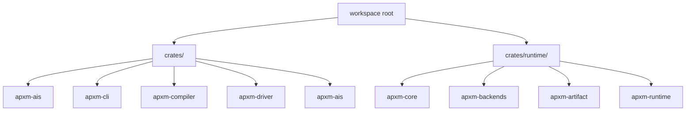

## 1. Complete System Flow

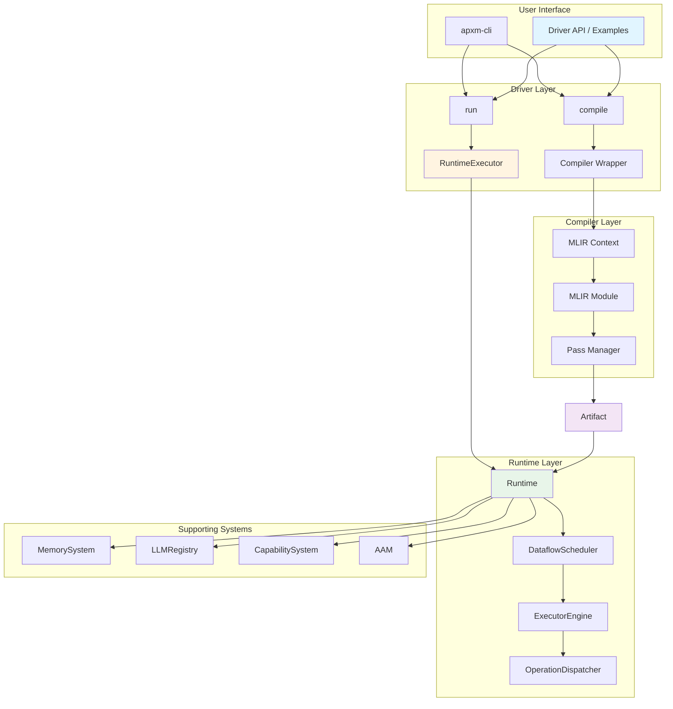

## 2. Compilation Pipeline Detail

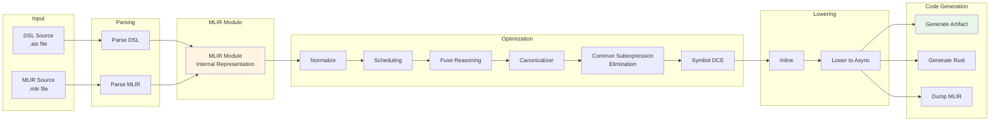

## 2.5 Shared Ops + End-to-End Flow

```mermaid
graph LR
    subgraph "Shared Operation Definitions"
        SHARED[apxm-ais (Rust ops)]
        TBLGEN[TableGen generator]
        TD[AIS .td files]
        RUST_META[Rust metadata]
    end

    subgraph "Compiler"
        DSL[AIS DSL]
        FRONT[Lexer/Parser/AST]
        MLIRGEN[MLIRGen]
        AISMLIR[AIS MLIR]
        PASSES[Pass Pipeline]
        ARTIFACT[Artifact]
    end

    subgraph "Runtime"
        RUNTIME[Runtime]
        SCHED[Dataflow Scheduler]
    end

    SHARED --> TBLGEN --> TD
    SHARED --> RUST_META

    DSL --> FRONT --> MLIRGEN --> AISMLIR --> PASSES --> ARTIFACT
    TD --> AISMLIR

    ARTIFACT --> RUNTIME
    RUST_META --> RUNTIME
    RUNTIME --> SCHED
```

## 3. Runtime Execution Detail

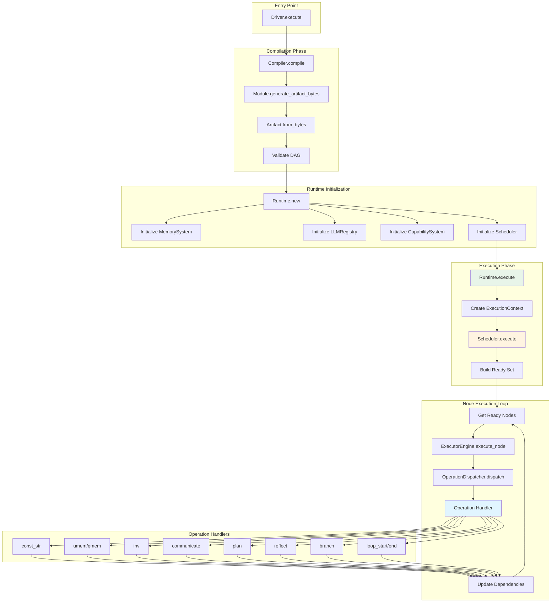

## 4. Memory System Architecture

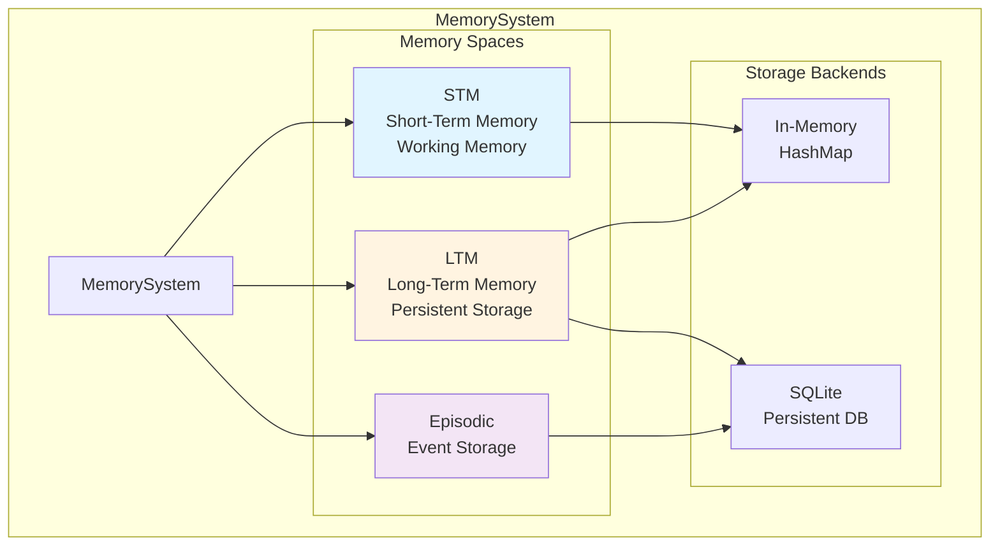

## 6. Scheduler Workflow

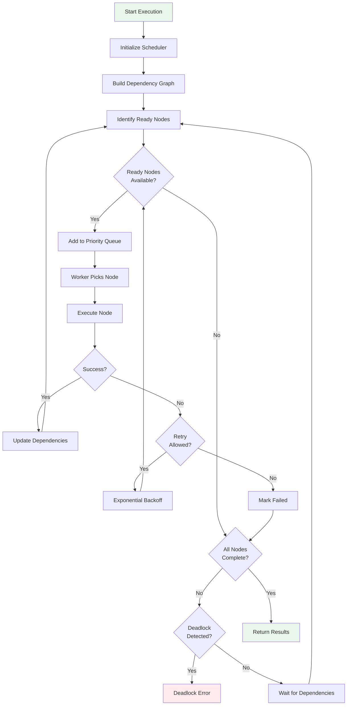

## 7. Operation Handler Dispatch

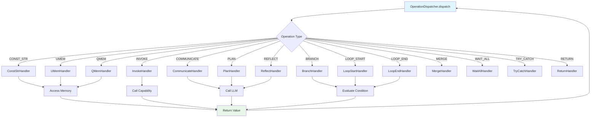

## 8. Artifact Format Structure

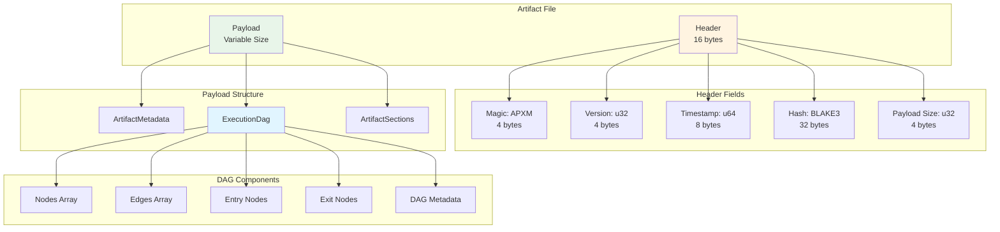

## 9. LLM Registry Architecture

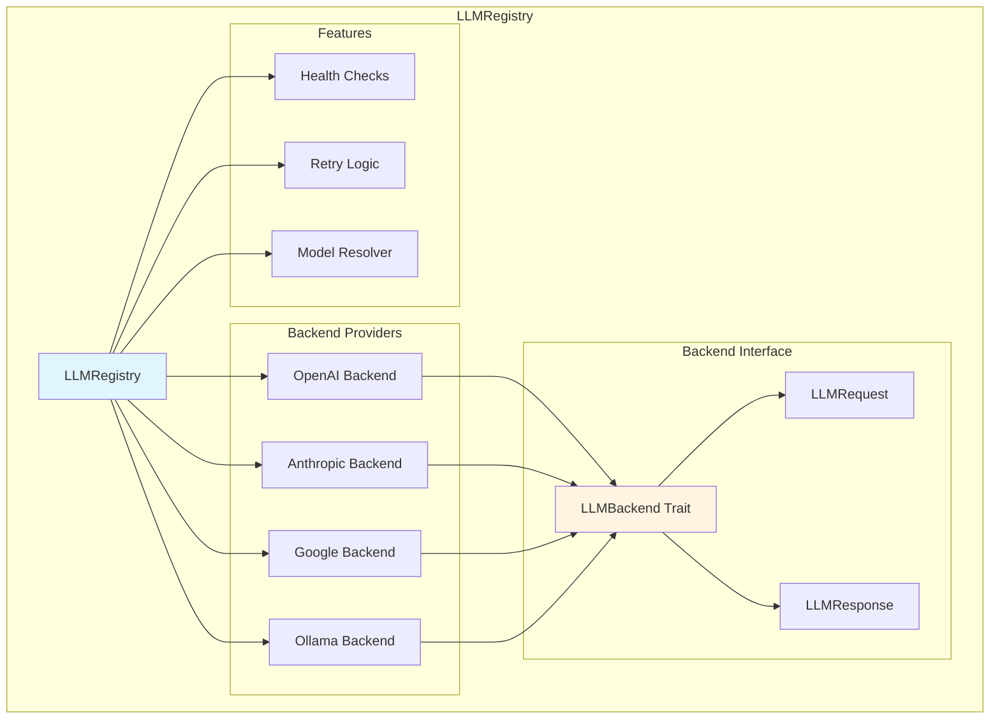

## 10. Configuration Loading Flow

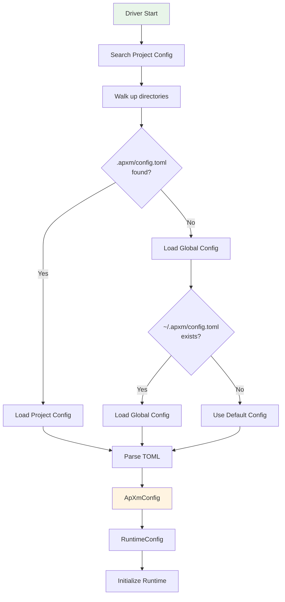

## 11. Error Propagation Flow

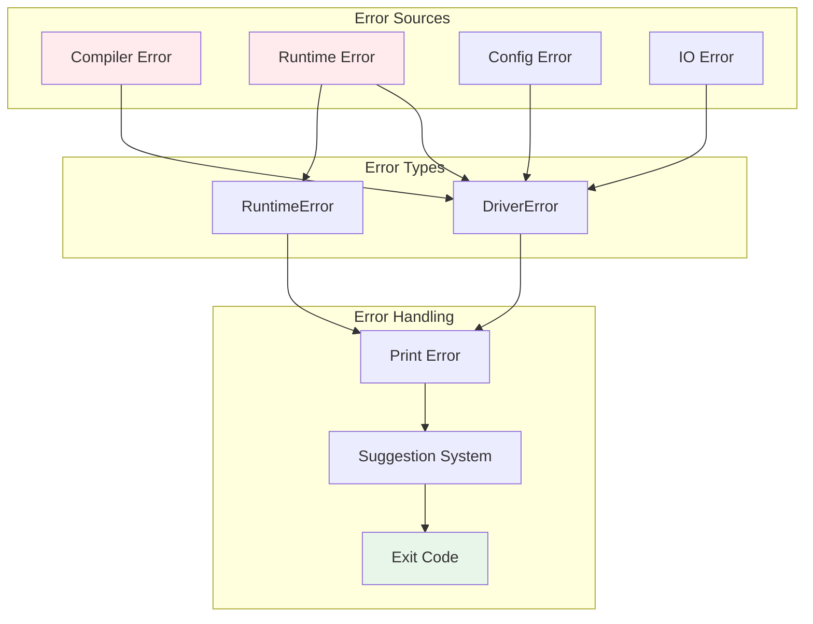

---

These diagrams provide visual representations of:
- System architecture and component relationships
- Data flow through compilation and execution
- Runtime execution details
- Memory and scheduler internals
- Configuration and error handling
- Shared operation definitions and end-to-end flow

Use these diagrams alongside the docs/architecture.md document for a complete understanding of the APXM system.
