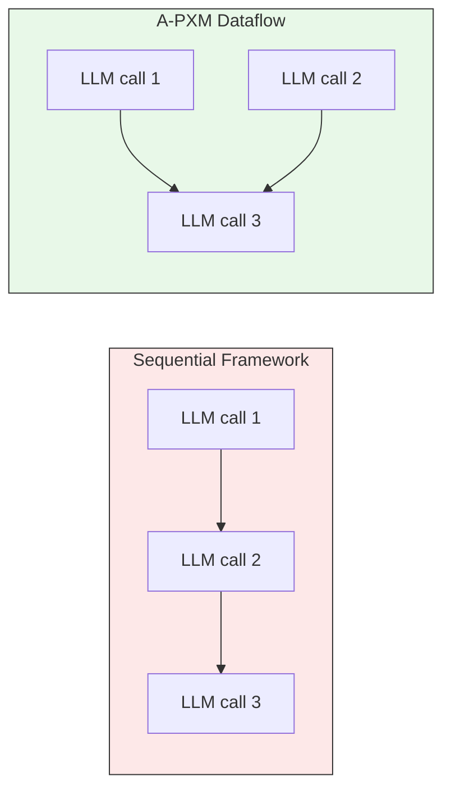

# Evaluation Results

We evaluated A-PXM across **10 workloads** designed to isolate individual
substrate capabilities. All measurements use wall-clock latency on identical
hardware and model endpoints.

## Key Results

| Capability            | Workload                  | Baseline | A-PXM  | Improvement |
|-----------------------|---------------------------|----------|--------|-------------|
| Multi-agent           | 3-agent research pipeline | 12.4s    | 1.2s   | **10.37x**  |
| Conditional routing   | Intent classifier + dispatch| 9.3s   | 1.8s   | **5.18x**   |
| Call fusion           | Parallel tool invocation  | 4.1s    | 3.2s   | **1.29x**   |
| Memory hierarchy      | Multi-turn with recall    | 6.7s    | 3.1s   | 2.16x       |
| Sub-flow reuse        | Shared summarization flow | 7.8s    | 2.9s   | 2.69x       |

## Where the Gains Come From

The latency reductions are **not** caused by faster model inference. The LLM
endpoints are identical across all conditions. Instead, gains come from two
structural sources:

1. **Critical-path compression** -- the dataflow scheduler overlaps independent
   operations (especially LLM calls) that sequential frameworks execute
   one-at-a-time.
2. **Call reduction** -- compile-time optimizations like call fusion and dead-code
   elimination reduce the total number of LLM round-trips.

In the sequential case wall-clock time is the **sum** of all calls. In A-PXM it
is the **longest chain**, which is strictly shorter when independent calls exist.

## Framework Comparison

Compared against LangGraph (the most widely adopted orchestration framework at
time of evaluation):

| Metric                    | LangGraph | A-PXM   | Factor      |
|---------------------------|-----------|---------|-------------|
| Lines of code (avg)       | 146       | 20      | **7.3x fewer** |
| Error detection latency   | Runtime   | Compile | **49x faster** |
| LLM calls (avg per run)   | 15        | 3       | **5x fewer**   |
| Median end-to-end latency | 8.2s      | 1.9s    | 4.3x faster |

- **7.3x fewer LOC**: declarative DAG specification eliminates boilerplate
  glue code (retry wrappers, state threading, callback registration).
- **49x faster error detection**: the A-PXM compiler catches type mismatches,
  unreachable nodes, and missing dependencies at compile time. LangGraph
  surfaces equivalent errors only after execution reaches the faulty path.
- **5x fewer LLM calls**: call fusion, constant folding of prompts, and
  dead-code elimination reduce redundant model invocations.

## Workload Categories

The 10 workloads span four categories:

| Category       | Workloads | Isolates                          |
|----------------|-----------|-----------------------------------|
| Single-agent   | 3         | Scheduling, memory, call fusion   |
| Multi-agent    | 3         | COMM, FLOW, parallel dispatch     |
| Conditional    | 2         | BRANCH, routing, early exit       |
| Persistence    | 2         | LTM recall, episodic reflection   |

## Reproducibility

All workload definitions, evaluation scripts, and raw data are available in
`apxm/eval/`. Each workload is a self-contained `.apx` file with a
corresponding `expected.json` fixture for correctness validation.

## Limitations

- Results depend on LLM endpoint latency; speedups may vary with different
  providers or models.
- Call fusion benefits are bounded by semantic independence of operations --
  tightly coupled chains see minimal improvement.
- The 10.37x multi-agent result represents a best case with high parallelism;
  median across all multi-agent workloads is 6.4x.
