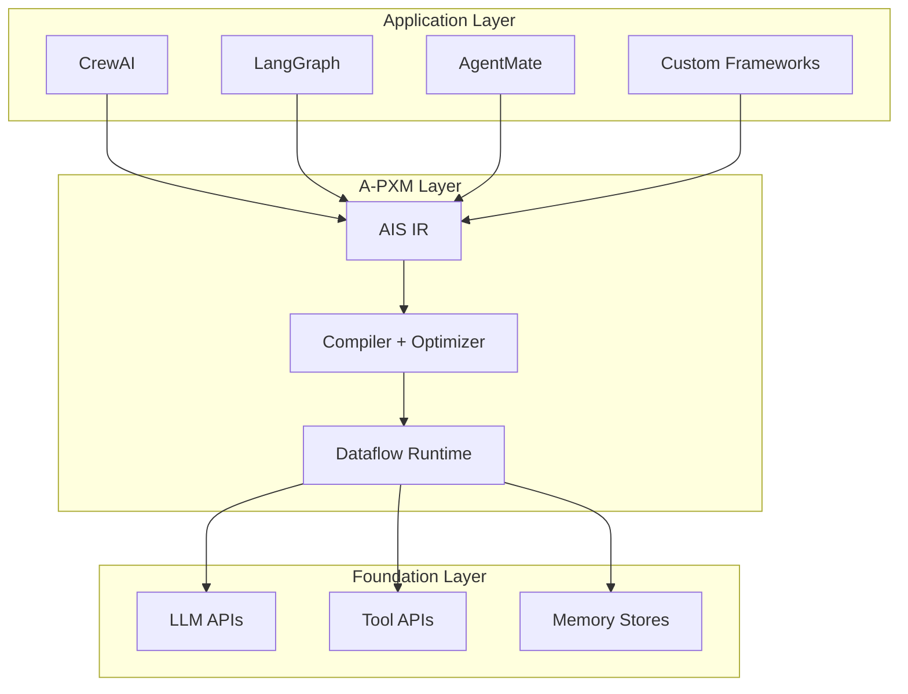

# What is A-PXM?

**A-PXM** (Agent Program Execution Model) is a formal execution substrate for agentic AI systems. It sits between high-level orchestration frameworks (CrewAI, LangGraph, AgentMate) and the low-level foundation services (LLM APIs, tool APIs, memory stores), providing a principled intermediate layer that separates **what** an agent does from **how** it runs.

The relationship is analogous to LLVM IR in traditional compilers: just as LLVM decouples source languages from target architectures, A-PXM decouples agent orchestration logic from execution strategy.

## The Agentic Software Stack

## Three Pillars

A-PXM is built on three interlocking abstractions:

| Pillar | Role | Analogy |
|--------|------|---------|
| **AAM** (Agent Abstract Machine) | Defines the agent's state model: Beliefs, Goals, Capabilities, and a three-tier memory hierarchy | CPU register file + memory model |
| **AIS** (Agent Instruction Set) | A typed intermediate representation of 17 instructions operating on AAM state | ISA / LLVM IR opcodes |
| **Dataflow Execution** | Plans compile into directed acyclic graphs where operations fire when all input tokens are available | Dataflow architectures (Manchester Machine) |

Together, these three pillars provide:

- **Explicit state**: every piece of agent knowledge is typed and addressable.
- **Explicit dependencies**: data edges in the DAG declare what each operation needs.
- **Explicit effects**: side effects (tool calls, LLM invocations, memory writes) are first-class operations with typed results.

## Why It Matters

Without an execution model, agentic frameworks rediscover the same problems independently: how to schedule parallel tool calls, how to handle partial failures, how to share context across agents. A-PXM provides a single, optimizable substrate so that framework authors focus on developer experience while the runtime handles scheduling, parallelism, and fault recovery.

## Key Results

Across 10 evaluation workloads, A-PXM delivers:

- Up to **10.37x latency reduction** in multi-agent workloads
- **5.18x improvement** in conditional routing via critical-path compression
- **1.29x call reduction** through producer-consumer fusion
- **7.3x fewer lines of code** compared to equivalent LangGraph implementations
- **49x faster error detection** through compile-time type checking
