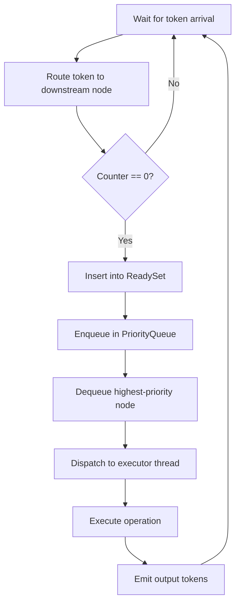

# Dataflow Scheduler

The scheduler is the core execution loop of the A-PXM runtime. It uses a
**token-counting** strategy that avoids graph traversal entirely, achieving O(1)
readiness detection per operation.

## Token Model

Every operation (node) in the DAG maintains a **pending counter** initialized to
its in-degree. When an upstream operation completes:

1. A token is routed to each downstream node.
2. The counter is atomically decremented.
3. If the counter reaches zero the node is moved to the **ready set**.

No scanning or traversal is required -- readiness is an O(1) decrement-and-test.

## Per-Operation Overhead Breakdown

Total overhead per operation: **7.5 microseconds**.

| Phase                 | Time   | Share  |
|-----------------------|--------|--------|
| Ready set update      | 1.8 us | 24.0%  |
| Priority queue dequeue| 0.9 us | 12.0%  |
| Dependency resolution | 1.4 us | 18.7%  |
| Operation dispatch    | 2.4 us | 32.0%  |
| Token routing         | 1.0 us | 13.3%  |

Dispatch dominates because it includes the transition from scheduler thread to
executor thread (cross-thread handoff via bounded channel).

## Scheduler State

```rust
struct SchedulerState {
    tokens: DashMap<TokenId, TokenState>,   // live token metadata
    ops: DashMap<NodeId, OpState>,          // pending counters + status
    ready: ReadySet,                        // lock-free set of runnable nodes
    queue: PriorityQueue<NodeId, Priority>, // scheduling order
}
```

`DashMap` provides sharded concurrent access so multiple executor threads can
retire tokens without contending on a single lock.

## Work Stealing

Executor threads are organized in a work-stealing pool. Each thread owns a local
deque of ready operations. When a thread's deque is empty it steals from a random
peer, keeping all cores busy even under skewed DAG shapes.

## Scheduler Loop



## Priority Policy

Nodes on the **critical path** (longest path to a sink) receive higher priority.
The compiler annotates each node with a static priority estimate; the scheduler
uses it as the initial key and may adjust dynamically based on observed latency.

## Backpressure

If the ready set exceeds a configurable high-water mark the scheduler stops
accepting new external triggers, applying backpressure to upstream callers. This
prevents unbounded memory growth in bursty workloads.

## Design Rationale

- **Token counting** is simpler and faster than traditional dataflow firing
  rules while being equivalent for acyclic graphs.
- **DashMap** over `RwLock<HashMap>` eliminates reader-writer contention at the
  cost of slightly higher per-key overhead -- a worthwhile trade at the
  concurrency levels A-PXM targets.
- **Work stealing** adapts automatically to heterogeneous operation durations
  without requiring a centralized load balancer.
