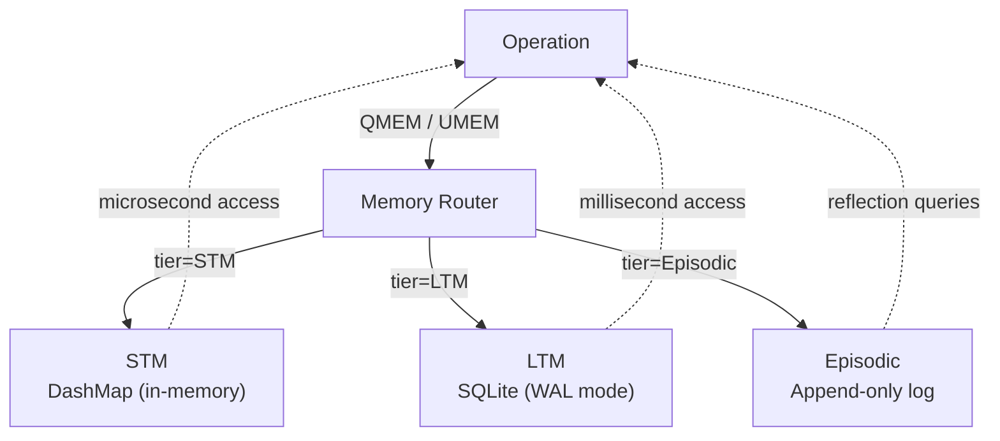

# Memory Hierarchy

A-PXM provides three memory tiers, each optimized for a different access pattern.
Operations interact with memory through dedicated instructions rather than
arbitrary host-language calls.

## Tiers

| Tier     | Backing Store       | Latency       | Semantics            |
|----------|---------------------|---------------|----------------------|
| **STM**  | In-memory KV map    | Microseconds  | Scratch / working    |
| **LTM**  | SQLite database     | Milliseconds  | Persistent knowledge |
| **Episodic** | Append-only log | Milliseconds  | Execution traces     |

### STM (Short-Term Memory)

A concurrent `DashMap<String, Value>` scoped to the current execution. Used for
passing intermediate results between operations when the dataflow token is not
sufficient (e.g., accumulator patterns). Cleared automatically when execution
completes.

### LTM (Long-Term Memory)

Backed by an embedded SQLite instance. Survives across executions and is shared
by all flows within an agent. Typical uses include user preferences, learned
facts, and cached tool results.

### Episodic Memory

An append-only log of execution events (operation start/end, token values,
errors). Designed for **reflection** -- agents can query their own history to
improve future decisions. The log is indexed by timestamp and flow ID.

## Concurrency Model

Each tier has an **independent lock** so that a slow LTM write does not block a
fast STM read. Within a tier:

- **STM**: lock-free via `DashMap` sharding.
- **LTM**: SQLite WAL mode allows concurrent readers with a single writer.
- **Episodic**: single-writer append; readers snapshot via WAL.

## Instructions

| Instruction | Operands              | Description                        |
|-------------|-----------------------|------------------------------------|
| `QMEM`     | tier, key             | Query (read) a value from a tier   |
| `UMEM`     | tier, key, value      | Update (write) a value to a tier   |
| `FENCE`    | tier                  | Memory fence -- flush pending writes |

`FENCE` ensures all preceding writes to the specified tier are visible to
subsequent reads, which matters when LTM writes are batched for throughput.

## Architecture

## Lifecycle

1. **Execution starts** -- STM is initialized empty; LTM and Episodic are opened
   from disk.
2. **During execution** -- operations issue `QMEM` / `UMEM` as needed. Episodic
   log entries are appended automatically by the runtime for every operation
   boundary.
3. **Execution ends** -- STM is dropped. LTM and Episodic are flushed and remain
   on disk for future runs.

## Design Rationale

- **Three tiers** mirror cognitive models of working, long-term, and
  autobiographical memory, giving flow authors intuitive semantics.
- **SQLite** for LTM avoids external database dependencies while supporting
  full SQL queries when agents need complex retrieval.
- **Append-only episodic log** is simple to implement correctly under
  concurrency and naturally supports time-range queries for reflection.
