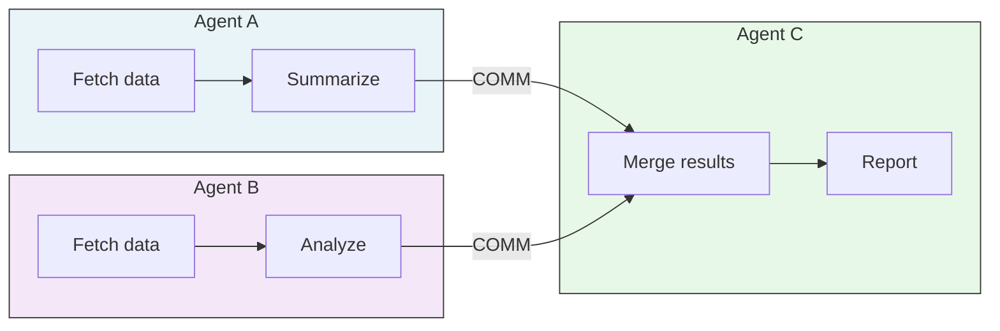

# Multi-Agent Execution

A-PXM supports multi-agent workloads natively through two instructions and the
parallelism inherent in its dataflow model.

## Instructions

### COMM (Communicate)

Sends a **typed message** from one agent to another. Messages are routed through
the runtime's message bus and delivered as tokens to the receiving agent's
dataflow graph.

```
COMM target_agent, channel, payload
```

- `target_agent` -- identifier of the receiving agent.
- `channel` -- named channel for multiplexing (e.g., `"request"`, `"status"`).
- `payload` -- any serializable value; type-checked at compile time.

### FLOW (FlowCall)

Invokes a **flow defined in another agent** and awaits its result. Semantically
equivalent to a remote procedure call but executed within the same runtime
process.

```
FLOW target_agent, flow_name, args -> result
```

The callee's DAG is scheduled alongside the caller's, enabling the scheduler to
overlap independent operations across both agents.

## Parallelism Model

Multi-agent parallelism emerges directly from the dataflow structure:

1. Each agent's DAG is merged into a **unified scheduler graph**.
2. Operations with no data dependency execute concurrently regardless of which
   agent owns them.
3. `COMM` and `FLOW` introduce explicit edges between agents, and only those
   edges constrain ordering.

This means two agents performing independent LLM calls will naturally run in
parallel without any user-written concurrency code.

## Performance

In evaluated workloads, multi-agent dataflow scheduling achieves up to
**10.37x latency reduction** compared to sequential orchestration frameworks.

The gains come from **critical-path compression**: by overlapping independent
operations across agents, the wall-clock time approaches the length of the
longest dependency chain rather than the sum of all operations.

| Workload               | Sequential | A-PXM  | Speedup |
|------------------------|-----------|--------|---------|
| 3-agent research       | 12.4s     | 1.2s   | 10.37x  |
| 2-agent code review    | 8.1s      | 2.3s   | 3.52x   |
| 5-agent data pipeline  | 31.0s     | 5.8s   | 5.34x   |

## Topology



In this topology, Agent A and Agent B execute fully in parallel. Agent C blocks
only on the two `COMM` edges, then proceeds immediately.

## Error Propagation

When an agent fails:

1. The runtime cancels all in-flight operations owned by that agent.
2. A `AgentError` token is propagated along every outgoing `COMM` / `FLOW` edge.
3. Receiving agents can handle the error via `BRANCH` on the error token or let
   it propagate upward.

## Design Rationale

- **Unified scheduler graph** avoids the overhead of per-agent event loops and
  enables global work stealing across agent boundaries.
- **Typed COMM channels** catch integration mismatches at compile time rather
  than at runtime, reducing debugging cost in multi-agent systems.
- **FLOW as inlined DAG** means cross-agent calls have the same overhead as
  local sub-flow invocations -- no serialization or IPC penalty.
