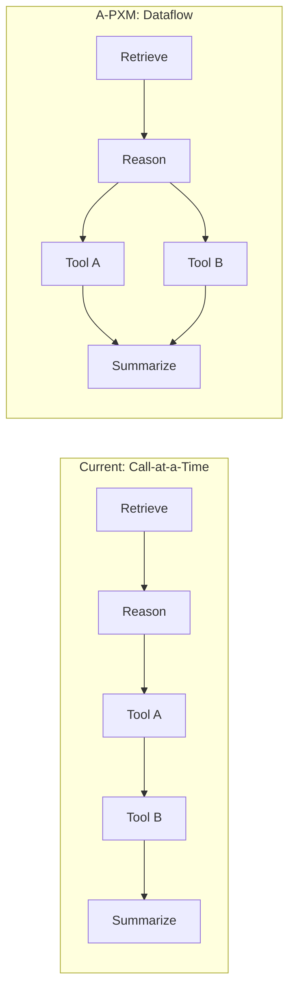

# The Agentic von Neumann Bottleneck

In his 1977 Turing Award lecture, John Backus described the **von Neumann bottleneck**: conventional programming languages force the programmer to think "one word at a time," shuttling data between memory and CPU through a narrow channel. The sequential, imperative style hides opportunities for parallelism and makes programs brittle to reordering.

Agentic AI frameworks today suffer from an analogous pathology. We call it the **agentic von Neumann bottleneck**: workflows execute as "call-at-a-time" scripts, issuing one LLM or tool invocation after another in rigid sequential order.

## The Call-at-a-Time Problem

Consider a typical agent workflow that retrieves context, reasons over it, invokes two independent tools, then synthesizes results. In current frameworks, this looks like:

```python
# Sequential execution -- every step blocks on the previous
context = retrieve(query)          # 200ms
analysis = llm.reason(context)     # 3000ms
result_a = tool_a(analysis)        # 500ms
result_b = tool_b(analysis)        # 800ms  <-- waits for tool_a!
summary = llm.ask(result_a, result_b)  # 1000ms
# Total wall time: 5500ms
```

`tool_a` and `tool_b` have no data dependency on each other, yet they execute sequentially because the programming model provides no way to express this independence. The wall time is the **sum** of all latencies rather than the **critical path**.

## Three Consequences

### 1. Latency Stacking

Every operation in the chain adds its full latency to wall-clock time, even when independent operations could overlap. In multi-agent scenarios, this compounds: agent B waits for agent A's entire pipeline before starting, even if it only needs one intermediate result.

### 2. Hidden Data Dependencies

When workflows are expressed as imperative scripts, the actual data flow between operations is implicit in variable scoping. The runtime cannot determine which operations are independent, which share state, or which have side effects. This prevents automatic parallelism and makes optimization impossible.

### 3. Error Compounding

Without explicit contracts between operations, errors in early stages propagate silently through the chain. A hallucinated intermediate result feeds into downstream tool calls and LLM prompts, compounding the error. By the time the final output is produced, the root cause is buried under layers of dependent operations.

## Outer Plan vs. Inner Plan

There is a fundamental disconnect in current agentic systems between two levels of planning:

| Level | Owner | Representation | Execution |
|-------|-------|----------------|-----------|
| **Outer plan** | Developer | Python code, YAML config | Framework runtime |
| **Inner plan** | LLM | Chain-of-thought, tool-use decisions | Model inference |

The outer plan is the developer's workflow: "retrieve, reason, act." The inner plan is the model's reasoning within each step. Current frameworks provide **no shared contract** between these two levels. The outer plan cannot constrain or verify the inner plan, and the inner plan cannot inform the outer plan's scheduling decisions.

## What We Need

Solving the agentic von Neumann bottleneck requires three things that current frameworks lack:

1. **Explicit state**: a formal model of what the agent knows, wants, and can do -- not implicit Python variables scattered across closures.

2. **Explicit dependencies**: data edges that declare exactly which operations depend on which results, enabling automatic parallelism without developer intervention.

3. **Explicit effects**: side effects (LLM calls, tool invocations, memory writes) must be first-class operations with typed inputs and outputs, not opaque function calls hidden behind `await`.

A-PXM provides all three through the Agent Abstract Machine (state), the Agent Instruction Set (typed operations), and dataflow execution (dependency-driven scheduling).



In the dataflow model, Tool A and Tool B execute in parallel automatically -- the graph structure makes their independence explicit.
